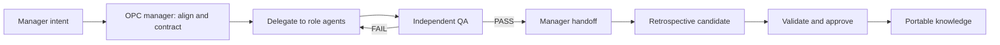

# Codex OPC Team

[简体中文](README.zh-CN.md) · [v0.1.1-rc.1 notes](docs/release-notes-v0.1.1-rc.1.en.md) · [Stable v0.1.0 notes](docs/release-notes-v0.1.0.en.md) · [Architecture](docs/architecture.md) · [Security](SECURITY.md) · [Roadmap](docs/roadmap.md)

Codex OPC Team is an open-source, Codex-native operating model for a one-person company. It turns a project request into an aligned plan, delegated implementation, independent QA, and an evidence-backed retrospective while keeping the user in the manager role.

Codex remains the harness. The project does not replace Codex's file, browser, web, tool, and sub-agent capabilities with another agent runtime.

## Design principles

| Principle | Meaning |
|---|---|
| Codex-native | Reuse Codex as the execution harness and distribute the team as a plugin. |
| Manager-first | Ask the user for direction and material decisions, not routine implementation details. |
| Portable memory | Git-managed files are the durable source of truth. |
| Optional Mem0 | Mem0 can improve semantic recall, but the full workflow must work without it. |
| Progressive context | Private, disposable L0/L1 navigation limits canonical L2 reads; every injected leaf is revalidated against current File/Git HEAD. |
| Auditable use | Private role/step lineage distinguishes recall, injection, adoption, omission, and evidence association without claiming causality. |
| Controlled learning | Experience moves from candidate to manager-approved knowledge, then becomes recallable only after an exact Git commit is verifiable at the current HEAD; it is never silently promoted. |
| Independent acceptance | A developer's self-report is not QA evidence. The manager is notified only after an independent gate. |
| Private by default | Public plugin code is separated from private organizational knowledge and runtime data. |

## Operating loop



## Project status

`v0.1.0` is the first stable release. The Codex-native team loop, File/Git memory, optional Mem0 adapter, safe hooks, installer, and automated gates have passed the release checks. Use the fixed `v0.1.0` tag rather than `main` as the stable install source. See the [v0.1.0 release notes](docs/release-notes-v0.1.0.en.md), [roadmap](docs/roadmap.md), and [acceptance contract](docs/testing-and-acceptance.md).

`v0.1.1-rc.1` is the public release candidate for stricter runtime-data isolation and installed-plugin lifecycle acceptance. It is pre-release software, not the stable channel. Reviewers and release testers may install the immutable candidate snapshot with `codex plugin marketplace add coconilu/codex-opc-team --ref v0.1.1-rc.1`; production users should remain on `v0.1.0` until the stable release Gate passes. See the [release-candidate notes](docs/release-notes-v0.1.1-rc.1.en.md).

The v0.2 context, feedback, evaluation, conflict, lineage, and governed capability-evolution components are implemented on `main`, and their public synthetic release evidence passes. **v0.2.0 is not release-ready:** the required representative private 3–5 task pilot and exact-release-commit gates do not yet exist. Public fixtures or templates cannot substitute for that evidence. See [v0.2 release readiness](docs/release-readiness-v0.2.0.md).

## Installation

Prerequisites: Codex CLI, Git, and Python 3.10 or newer. Mem0 is not required.

Add the `v0.1.0` repository snapshot as a Codex marketplace and install the plugin:

```powershell
codex plugin marketplace add coconilu/codex-opc-team --ref v0.1.0
codex plugin add codex-opc-team@opc
```

The default File/Git memory mode has no Mem0 dependency. Mem0 setup is optional and must degrade safely when unavailable. Detailed install, upgrade, removal, and data-retention behavior is documented in [installation and distribution](docs/installation-and-distribution.md); release-specific compatibility, migration, rollback, and evidence are in the [v0.1.0 release notes](docs/release-notes-v0.1.0.en.md).

## Quick start after installation

After installing, upgrading, or rolling back the plugin, start a new Codex task so the plugin catalog is reloaded. Most work should begin with `$opc-manager`; choose another Skill when you only need one bounded step.

| What you want to do | Entry point | What you get |
|---|---|---|
| Deliver a feature, fix, or small project from idea to an experience-ready result | `$opc-manager` | Goal alignment, project contract, role delegation, independent QA, manager handoff, and governed retrospective |
| Onboard an existing repository without starting implementation | `$opc-project-bootstrap` | Minimal, versionable project metadata, brief, and acceptance contract |
| Independently validate an existing implementation | `$opc-qa-gate` | Criterion-by-criterion evidence; failures return a reproducible repair contract instead of a weak PASS |
| Extract reusable candidates from completed or failed work | `$opc-retrospective` | Source- and evidence-backed experience candidates that are not automatically promoted |
| Decide whether a candidate is safe and reusable | `$opc-memory-curator` | Scope, conflict, privacy, replay, and rollback checks followed by an explicit manager approval request |
| Inspect or manage the recall layer | `$opc-memory` | File/Git status and Doctor; optional Mem0 setup, rebuild, and disable operations use preview before authorization |

The first `$opc-manager` run performs a Doctor check. If the private File/Git knowledge repository is not initialized, it shows the target directory and explains that initialization creates an independent private Git repository with a baseline commit. Nothing is written until you explicitly confirm, and Mem0 is not enabled as part of that initialization.

### Development-only local Dashboard

The `main` branch includes an explicitly started, loopback-only, read-only Dashboard for manager visibility. It is not part of stable `v0.1.0`, does not scan for projects, and has no approval or promotion actions:

```powershell
python plugins/codex-opc-team/scripts/opc_dashboard.py --project-root .
```

The command prints the local URL and attempts to open it in the default browser; press `Ctrl+C` to stop. See [OPC Dashboard](docs/opc-dashboard.md) for its data, privacy, and degradation boundaries.

### Who owns which decisions

| Manager (you) | OPC team |
|---|---|
| Decide product direction, scope changes, risk tradeoffs, and whether to continue | Inspect the real repository and turn the request into scope, assumptions, non-goals, and acceptance criteria |
| Explicitly authorize commits, pushes, deployments, external messages, credentials, purchases, or destructive actions | Delegate roles, implement, test, and repair within the authorized boundary |
| Experience independently accepted results and approve or reject knowledge promotion | Validate with independent evidence; implementer self-report never counts as QA PASS |

### Copyable examples

The names and data below are synthetic. Open a new Codex task in the target repository and adapt the example to your real requirements.

**Example 1: deliver a feature end to end**

```text
$opc-manager
Take ownership of the current repository and deliver “add theme selection to the settings page.”

Goal: users can choose light, dark, or system mode, and the choice survives a refresh.
Flow: align the goal with me and create the project contract before delegating implementation; use independent QA after implementation, hand off only after PASS, and finish with a governed retrospective candidate.
Acceptance: all three options work in the real UI; refresh preserves the correct state; existing tests pass; the new behavior has automated coverage; independent QA passes the same acceptance matrix.
Authority boundary: you may edit this repository and run local tests; do not commit, push, deploy, use real accounts, or change global Codex configuration unless I authorize it separately.
Non-goals: do not redesign the entire design system or add cloud synchronization.
Handoff: explain what changed, how I can try it, verification evidence, known limitations, and decisions that still require me.
```

**Example 2: onboard an existing repository**

```text
$opc-project-bootstrap
Onboard the current existing repository into the OPC team.

Goal: derive a minimal project contract from the real README, AGENTS.md, manifests, and test commands.
Acceptance: create versionable .opc/project.json, .opc/project.md, and .opc/acceptance.md; keep runtime files ignored; preserve the existing AGENTS.md and working-tree changes.
Authority boundary: create only the minimum onboarding files; ask before changing AGENTS.md; do not start implementation, commit, or push.
Non-goals: do not refactor source code or create a new service, database, or agent runtime.
Handoff: list created files, inferred verification commands, missing information, and whether the repository is ready for $opc-manager.
```

**Example 3: fix a defect, independently accept it, and retrospect**

```text
$opc-manager
Fix “exports fail on Windows when the filename contains a colon,” then complete independent acceptance and a retrospective.

Goal: Windows exports produce legal, traceable filenames without regressing other platforms.
Acceptance: reproduce the original failure first; cover colons, reserved characters, duplicate names, and ordinary names; run targeted tests plus every repository-required gate; use a QA role independent from implementation, and if it fails, repair and rerun the unchanged matrix.
Authority boundary: you may edit and test this repository; do not read real user files, commit, push, or publish.
Non-goals: do not change the export format or spread platform-specific rules into unrelated modules.
Handoff: provide reproduction and repair evidence, the QA verdict, and a trial path; the retrospective may only create candidates and must not auto-approve or rewrite organizational rules.
```

Typical versionable project artifacts are `.opc/project.json`, `.opc/project.md`, `.opc/acceptance.md`, and, when useful, evidence under `.opc/qa/`. Active-run markers and Hook fallback events are local runtime state and must not be published as organizational knowledge.

These entry points describe the six canonical Skills in stable `v0.1.0`. Mem0 is only an optional, rebuildable recall index. `v0.1.1-rc.1` remains a pre-release candidate, and v0.2 components on `main` are not the same as released stable capabilities. The project has no always-on autonomous service: experience is never auto-promoted, and the plugin does not silently commit, deploy, or change global Codex configuration.

Learn more: [installation and distribution](docs/installation-and-distribution.md) · [architecture](docs/architecture.md) · [testing and acceptance](docs/testing-and-acceptance.md) · [memory architecture](docs/memory-architecture.md) · [knowledge governance](docs/knowledge-governance.md)

## Public code, private knowledge

This repository contains plugin behavior, schemas, empty templates, tests, and documentation. It must not contain a user's manager profile, project history, approved organizational experience, raw conversations, credentials, local paths, or runtime identifiers.

Private knowledge is initialized outside the plugin cache and remains user-controlled. Removing the plugin must not delete that knowledge.

Hook/runtime events live in private `PLUGIN_DATA` or a project `.opc` fallback, never in canonical knowledge. `opc-memory` reports known legacy event artifacts without reading their contents and requires a dry-run plus a separately approved, unchanged plan before archiving them.

Hierarchical recall is zero-dependency and optional. Its virtual tree, L0/L1 summaries, and index live only under an explicit private data root, are Git-ignored, deletable, and rebuildable, and never become facts. Missing, stale, invalid, disabled, timed-out, or disagreeing derived/provider state falls back to File/Git. The public synthetic comparison reports precision@5 `0.20 → 1.00`, canonical leaf recall@5 `1.00 → 1.00`, median injected tokens `661 → 107`, and zero scope/stale acceptance; this is evidence for that fixture, not a universal performance claim. See [hierarchical recall and ContextPacket](docs/hierarchical-recall.md).

Knowledge lineage is an optional private `.opc` sidecar. It binds exact run/project and ContextPacket/RecallTrace hashes to role/step states, provider degradation, QA, feedback, outcome, Shadow, and evaluation references. Reports revalidate current File/Git provenance and always state `association/evidence only`; they never infer adoption or causality. See [knowledge lineage](docs/knowledge-lineage.md).

Capability evolution is an evidence-gated private lifecycle for versioned roles, Skills, and organization policies. It requires exact Git blobs, replay/Shadow evidence, independent QA, explicit manager approvals, bounded paired pilots, and a one-path unstaged promotion or rollback followed by explicit commit confirmation. It never changes global Codex config or claims causality. See [controlled capability evolution](docs/capability-evolution.md).

## Documentation

| Document | Purpose |
|---|---|
| [v0.1.1-rc.1 release-candidate notes](docs/release-notes-v0.1.1-rc.1.en.md) | Pre-release scope, verification, known limitations, and rollback to stable |
| [v0.1.0 release notes](docs/release-notes-v0.1.0.en.md) | Compatibility, installation, migration, limitations, rollback, and gate evidence |
| [Origin and decisions](docs/origin-and-decisions.md) | Why this project exists and how the design converged |
| [Vision and scope](docs/vision-and-scope.md) | Product goals, boundaries, and user experience |
| [Architecture](docs/architecture.md) | Components, contracts, and execution flow |
| [Memory architecture](docs/memory-architecture.md) | File/Git authority, optional Mem0, and learning governance |
| [Knowledge governance](docs/knowledge-governance.md) | Deterministic applicability, relations, conflicts, and Schema 1-to-2 migration |
| [Installation and distribution](docs/installation-and-distribution.md) | Local install, marketplace release, upgrade, and removal |
| [Migration](docs/migration-from-local-prototype.md) | Safe cutover from the local prototype |
| [Security and privacy](docs/security-and-privacy.md) | Data boundaries, hook safety, and publication checks |
| [Testing and acceptance](docs/testing-and-acceptance.md) | Test matrix and release gates |
| [Evaluation baseline](docs/evaluation-baseline.md) | Versioned synthetic File/Git baseline and private 3–5-task aggregate protocol |
| [Structured feedback](docs/structured-feedback.md) | Private, auditable manager judgment, QA evidence, outcome, and hypothesis records |
| [Shadow Evaluation](docs/shadow-evaluation.md) | Read-only candidate control/treatment replay with exact provenance and no automatic promotion |
| [Hierarchical recall](docs/hierarchical-recall.md) | Private L0/L1 navigation, canonical L2 validation, ContextPacket/RecallTrace, and flat comparison |
| [Knowledge lineage](docs/knowledge-lineage.md) | Private role/step knowledge states, portable outcome links, current-HEAD revalidation, and non-causal reports |
| [Capability evolution](docs/capability-evolution.md) | Versioned role/Skill/policy pilots, evidence gates, one-path Git handoff, observation, and rollback |
| [OPC Dashboard](docs/opc-dashboard.md) | Explicitly started local read-only manager view, data semantics, security boundaries, and limitations |
| [v0.2 release readiness](docs/release-readiness-v0.2.0.md) | Public synthetic evidence, private 3–5 task pilot protocol, exact-commit gates, blockers, and non-claims |
| [Roadmap](docs/roadmap.md) | Planned delivery stages |

Architecture decisions live under [`docs/adr`](docs/adr/README.md).

## Contributing and security

Read [CONTRIBUTING.md](CONTRIBUTING.md) before contributing. Report vulnerabilities according to [SECURITY.md](SECURITY.md); do not disclose sensitive reports in public issues.

## License

Apache License 2.0. See [LICENSE](LICENSE).
