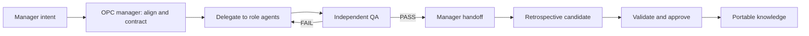

# Codex OPC Team

[简体中文](README.zh-CN.md) · [v0.1.1-rc.1 notes](docs/release-notes-v0.1.1-rc.1.en.md) · [Stable v0.1.0 notes](docs/release-notes-v0.1.0.en.md) · [Architecture](docs/architecture.md) · [Security](SECURITY.md) · [Roadmap](docs/roadmap.md)

Codex OPC Team is an open-source, Codex-native operating model for a one-person company. It turns a project request into an aligned plan, delegated implementation, independent QA, and an evidence-backed retrospective while keeping the user in the manager role.

Codex remains the harness. The project does not replace Codex's file, browser, web, tool, and sub-agent capabilities with another agent runtime.

## Design principles

| Principle | Meaning |
|---|---|
| Codex-native | Reuse Codex as the execution harness and distribute the team as a plugin. |
| Manager-first | Ask the user for direction and material decisions, not routine implementation details. |
| Portable memory | Git-managed files are the durable source of truth. |
| Optional Mem0 | Mem0 can improve semantic recall, but the full workflow must work without it. |
| Controlled learning | Experience moves from candidate to manager-approved knowledge, then becomes recallable only after an exact Git commit is verifiable at the current HEAD; it is never silently promoted. |
| Independent acceptance | A developer's self-report is not QA evidence. The manager is notified only after an independent gate. |
| Private by default | Public plugin code is separated from private organizational knowledge and runtime data. |

## Operating loop



## Project status

`v0.1.0` is the first stable release. The Codex-native team loop, File/Git memory, optional Mem0 adapter, safe hooks, installer, and automated gates have passed the release checks. Use the fixed `v0.1.0` tag rather than `main` as the stable install source. See the [v0.1.0 release notes](docs/release-notes-v0.1.0.en.md), [roadmap](docs/roadmap.md), and [acceptance contract](docs/testing-and-acceptance.md).

`v0.1.1-rc.1` is the public release candidate for stricter runtime-data isolation and installed-plugin lifecycle acceptance. It is pre-release software, not the stable channel. Reviewers and release testers may install the immutable candidate snapshot with `codex plugin marketplace add coconilu/codex-opc-team --ref v0.1.1-rc.1`; production users should remain on `v0.1.0` until the stable release Gate passes. See the [release-candidate notes](docs/release-notes-v0.1.1-rc.1.en.md).

## Installation

Prerequisites: Codex CLI, Git, and Python 3.10 or newer. Mem0 is not required.

Add the `v0.1.0` repository snapshot as a Codex marketplace and install the plugin:

```powershell
codex plugin marketplace add coconilu/codex-opc-team --ref v0.1.0
codex plugin add codex-opc-team@opc
```

The default File/Git memory mode has no Mem0 dependency. Mem0 setup is optional and must degrade safely when unavailable. Detailed install, upgrade, removal, and data-retention behavior is documented in [installation and distribution](docs/installation-and-distribution.md); release-specific compatibility, migration, rollback, and evidence are in the [v0.1.0 release notes](docs/release-notes-v0.1.0.en.md).

## Public code, private knowledge

This repository contains plugin behavior, schemas, empty templates, tests, and documentation. It must not contain a user's manager profile, project history, approved organizational experience, raw conversations, credentials, local paths, or runtime identifiers.

Private knowledge is initialized outside the plugin cache and remains user-controlled. Removing the plugin must not delete that knowledge.

Hook/runtime events live in private `PLUGIN_DATA` or a project `.opc` fallback, never in canonical knowledge. `opc-memory` reports known legacy event artifacts without reading their contents and requires a dry-run plus a separately approved, unchanged plan before archiving them.

## Documentation

| Document | Purpose |
|---|---|
| [v0.1.1-rc.1 release-candidate notes](docs/release-notes-v0.1.1-rc.1.en.md) | Pre-release scope, verification, known limitations, and rollback to stable |
| [v0.1.0 release notes](docs/release-notes-v0.1.0.en.md) | Compatibility, installation, migration, limitations, rollback, and gate evidence |
| [Origin and decisions](docs/origin-and-decisions.md) | Why this project exists and how the design converged |
| [Vision and scope](docs/vision-and-scope.md) | Product goals, boundaries, and user experience |
| [Architecture](docs/architecture.md) | Components, contracts, and execution flow |
| [Memory architecture](docs/memory-architecture.md) | File/Git authority, optional Mem0, and learning governance |
| [Installation and distribution](docs/installation-and-distribution.md) | Local install, marketplace release, upgrade, and removal |
| [Migration](docs/migration-from-local-prototype.md) | Safe cutover from the local prototype |
| [Security and privacy](docs/security-and-privacy.md) | Data boundaries, hook safety, and publication checks |
| [Testing and acceptance](docs/testing-and-acceptance.md) | Test matrix and release gates |
| [Evaluation baseline](docs/evaluation-baseline.md) | Versioned synthetic File/Git baseline and private 3–5-task aggregate protocol |
| [Structured feedback](docs/structured-feedback.md) | Private, auditable manager judgment, QA evidence, outcome, and hypothesis records |
| [Shadow Evaluation](docs/shadow-evaluation.md) | Read-only candidate control/treatment replay with exact provenance and no automatic promotion |
| [Roadmap](docs/roadmap.md) | Planned delivery stages |

Architecture decisions live under [`docs/adr`](docs/adr/README.md).

## Contributing and security

Read [CONTRIBUTING.md](CONTRIBUTING.md) before contributing. Report vulnerabilities according to [SECURITY.md](SECURITY.md); do not disclose sensitive reports in public issues.

## License

Apache License 2.0. See [LICENSE](LICENSE).
