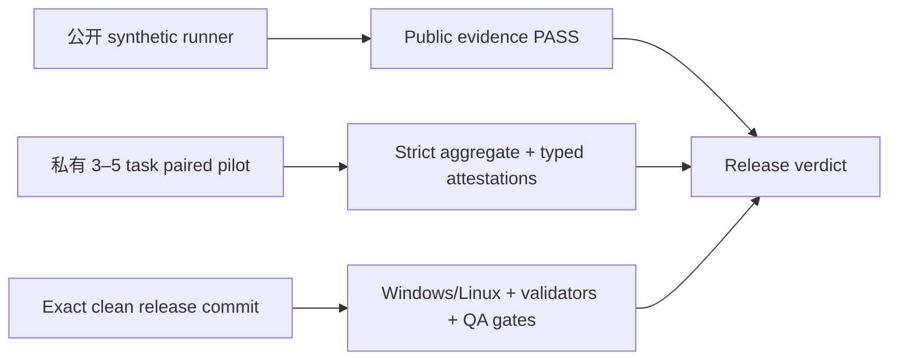

# ADR-0015：发布证据分离公开 fixture、私有 pilot 与 exact-commit Gate

- Status: Accepted
- Date: 2026-07-20

## Context

v0.2 把 Context Packet、结构化反馈、Shadow Evaluation、冲突治理、知识使用链路和能力版本演进连接到同一闭环。单独证明每个组件存在，不等于证明闭环在代表性任务中改善后续交付；反过来，把公开 synthetic 结果写成真实用户 pilot，也会制造不可审计的发布主张。

真实 3–5 task pilot 的源码、对话、逐任务结果、项目名和运行证据必须留在批准的私有项目边界。公开 CI 可以重放 synthetic fixture，却不能持有或验证这些私密正文。发布 tag 对应的 Windows/Linux、隐私、结构和独立 QA 证据又必须绑定 exact commit，不能由功能分支上的较早结果代替。

## Decision

发布采用三个互不替代的证据层：

1. `v0_2_release_evidence.py public/verify-public` 实际重放 File/Git baseline、hierarchical comparison 和跨能力 synthetic tests，提交确定性 JSON/Markdown；其性能数字只描述公开 fixture。
2. 私有 pilot 必须预先固定 3–5 个代表性任务和同一 evaluation contract 的 control/treatment。公开仓库只提供故意无效的模板和严格 Schema，不保存真实 pilot、逐任务数组或私有 artifact body。
3. aggregate 同时报告五项质量指标、context tokens、latency 和零容忍安全计数。至少一项质量指标严格改善且其他质量指标不回退；任何 scope leakage、stale/obsolete acceptance 或 privacy failure 均阻断。
4. Context Packet、feedback、lineage、Shadow 和 evolution coverage 与 task count 绑定；冲突 seed/rejection、rollback drill/exact restore 必须成对一致；Provider disabled 与 delete/rebuild 必须保持 canonical digest。
5. manager、独立 QA、Shadow 和 capability evolution 不是任意“文件存在”检查。每个 private evidence envelope 必须绑定 `pilot_id`、去除循环 attestation 后的 `pilot_core_sha256`、task count、evidence kind、decision、safety，以及实际私有 source artifact 的 ref/Hash；envelope 和 source 都必须位于同一 private `.opc` 下的单链接普通文件。
6. release checks 另以 envelope 绑定 private summary SHA-256、exact 40 字节 Git HEAD 与实际 gate log 的 ref/Hash；runner 要求 clean worktree，并逐项验证 Windows、Linux、repository validation、当前与历史隐私扫描、官方 Plugin Validator、全部 Skill quick validators、独立 release QA 和 rollback evidence。
7. 任一 private pilot 或 exact-commit gate 缺失时，release 状态固定为 `blocked`。Synthetic/template 不能替代 private pilot；未知状态不能按 PASS 解释。
8. 所有报告固定使用 `association/evidence only`，不得声称因果、统计普适性、自动自我改进或 AGI。

## Consequences

- 当前公开 synthetic evidence 可以独立复现，但在真实私有 pilot 和 exact-release-commit gates 产生前，`v0.2.0` 不得宣称 ready，也不应关闭 milestone tracking issue。
- 私有团队需要在批准的项目目录保存 aggregate、typed envelope 和 gate log；它们不进入本公开仓库、canonical knowledge、Provider 索引或公开 CI Artifact。
- 证据链更严格，但无法用自动化证明“填写人确实独立”。独立 QA 和经理批准仍是组织流程边界；typed envelope 只能防止错 subject、旧摘要或错误 decision 被复用。
- File/Git 继续权威；删除或禁用 derived/provider state 后，核心工作流和 canonical digest 必须保持。

## Rejected alternatives

- **用公开 synthetic 代替真实 pilot：** 无法证明代表性私有任务上的交付结果。
- **提交脱敏后的逐任务记录：** 小样本仍可能泄露项目或人员信息，也扩大公开数据面。
- **只保存 CI URL 或任意日志 Hash：** 没有 typed subject/decision 绑定，旧证据可被错配。
- **仅凭一项 token、latency 或 manager intervention 改善发布：** 可能掩盖质量或安全回退。
- **让 runner 自动 stage、commit、tag 或发布：** 超出证据验证职责，并破坏显式经理授权边界。

## POSIX verdict output boundary

Private verdict path output is supported only on Windows, where the runner binds native directory handles across the approved private-root chain and publishes with no-overwrite semantics. On POSIX, `private-pilot` and `release` remain fully usable for validation but are stdout-only: supplying `--output` fails before any directory entry is created. A caller may capture stdout only into an approved private boundary; capture into this public repository or a public CI artifact is forbidden.

This boundary is intentional. Linux does not provide one primitive that both links a prevalidated anonymous inode and applies constrained no-symlink target resolution (`RESOLVE_BENEATH`/`RESOLVE_NO_SYMLINKS`) atomically. Combining `openat2` validation with `linkat`, or validating after publication, reintroduces a rename race and would require forbidden best-effort cleanup. The runner therefore rejects POSIX path publication instead of claiming safety it cannot prove.
