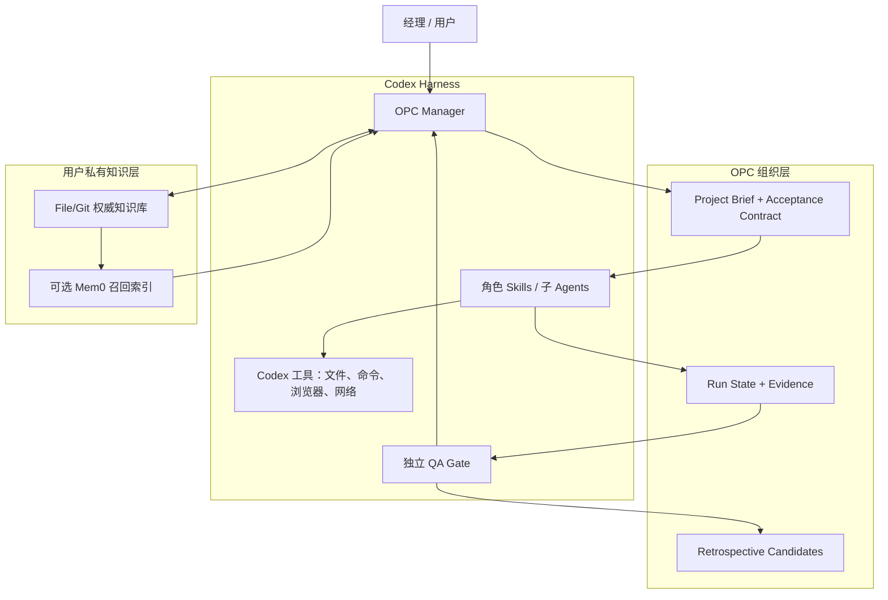
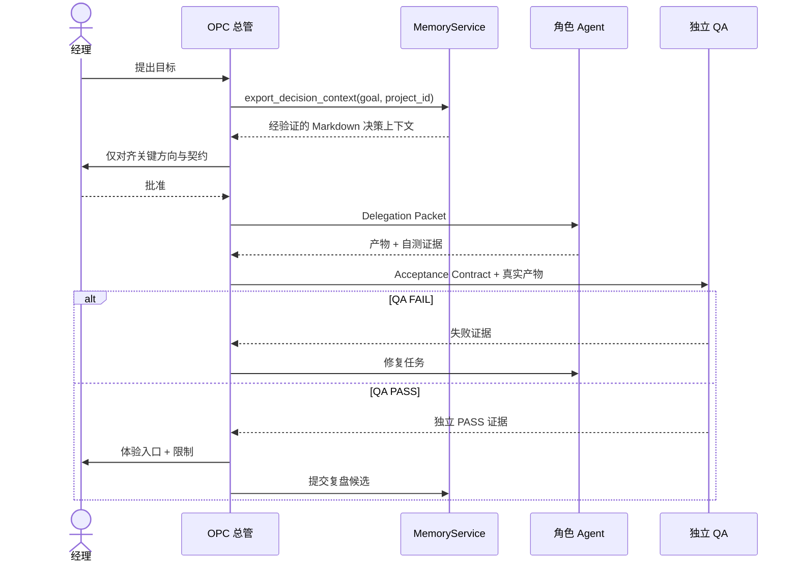

# 系统架构

## 1. 总览

Codex OPC Team 是运行在 Codex Harness 之上的组织工作层。它不持有模型循环，也不复制 Codex 工具；它提供工作协议、角色职责、记忆接口和质量门禁。



## 2. 分层与责任

| 层 | 负责 | 不负责 |
|---|---|---|
| Codex Harness | 模型、线程、子 Agent、权限、工具和工作区 | OPC 组织知识和角色治理 |
| Plugin Behavior | Skills、Hook、脚本、角色模板、工作协议 | 保存用户真实知识 |
| Project Runtime | 当前目标、项目简报、契约、任务状态和证据 | 跨项目权威知识 |
| Knowledge | 经批准经验、决策、偏好、流程和来源 | 执行命令或绕过权限 |
| Optional Recall | 语义检索候选 | 充当权威事实源或自动写规则 |

## 3. 核心组件

### 3.1 OPC Manager

总管是用户的单一管理入口，负责：

- 读取项目真实状态和相关知识；
- 区分可安全假设、需要研究和必须升级的决策；
- 形成 Project Brief 与 Acceptance Contract；
- 将任务委派给适合的角色，控制依赖和上下文；
- 汇总独立 QA 证据后向经理交接；
- 触发复盘，但不直接晋升组织知识。

### 3.2 Project Bootstrap

项目启动器把一个普通仓库接入 OPC，而不接管它。最小产物包括：

| 产物 | 内容 |
|---|---|
| Project Brief | 目标、用户、现状、范围、约束、关键决策 |
| Acceptance Contract | 可执行/可观察的验收条件和证据类型 |
| Run Marker | 用 `project_id`、`run_id`、`active` 与 `expires_at` 明确当前目录属于一次有效 OPC 运行 |
| Context References | 相关项目文件和经批准知识的引用，不复制整库 |

Run Marker 同时是 Hook 记录的前置安全条件。Marker 不存在、已结束、已过期、项目标识不匹配，或 `.opc` 通过符号链接逃逸 Workspace 时，Hook 必须不产生任何事件。

有效事件写入 `PLUGIN_DATA/run-events`；缺少可用的 `PLUGIN_DATA` 时回退到当前项目 `.opc/events.jsonl`。若 `PLUGIN_DATA` 被误配置到 `OPC_KNOWLEDGE_HOME` 内，Hook 必须使用项目回退路径，不能把运行事件写入权威知识库。该隔离决策见 [ADR-0007](adr/0007-runtime-events-outside-canonical-knowledge.md)。

### 3.3 Role Agents

角色通过 Skills 和子 Agent 配置表达。委派包遵循最小充分原则：

```text
Delegation Packet
├─ objective              当前子任务目标
├─ scope                  可以修改和不能修改的范围
├─ acceptance_subset      该角色负责满足的验收条目
├─ context_refs           必需文件和知识引用
├─ constraints            安全、兼容和产品约束
└─ handoff_contract       返回产物、证据和已知风险
```

角色不会继承整个私人知识库。总管或 `MemoryService` 只提供与当前任务相关、可追溯的上下文；下文的 Context Packet 是长期概念形状，不是 v0.1 已发布的 Python 数据类型。

### 3.4 Independent QA Gate

QA 读取 Acceptance Contract 和真实产物，而不是开发者的结论。证据可以包括测试报告、构建产物、浏览器截图、HTTP 响应、数据库查询或可重复的人工步骤。

QA 结果只有：

| 结果 | 条件 | 后续 |
|---|---|---|
| PASS | 所有阻断项通过，证据可追溯，限制已披露 | 总管可通知经理体验 |
| FAIL | 任一阻断项失败或缺少证据 | 返回具体失败、复现和期望修复 |
| BLOCKED | 外部状态或权限使验证无法完成 | 升级阻塞事实，不伪造 PASS |

### 3.5 Retrospective 与 Memory Curator

复盘把一次运行转换成经验候选；Memory Curator 检查来源、适用范围、冲突、重放或旁证。经理批准只会产生 `approved` 条目；策展流程精确提交该迁移后，当前 Git HEAD 可验证的条目才是 Published knowledge，才能被正常 File 召回或 Mem0 索引。

## 4. 标准执行序列



## 5. 状态与持久化边界

| 状态 | 位置 | 生命周期 |
|---|---|---|
| 插件代码和模板 | 安装缓存/插件仓库 | 随版本替换，可重新安装 |
| 插件运行数据 | Codex 提供的 `PLUGIN_DATA`；不可用时使用项目 `.opc` 回退 | 升级保留，卸载策略明确；永不进入知识库 |
| 项目运行标记和契约 | 项目自身 `.opc` 或约定目录 | 随项目版本控制策略管理 |
| 组织知识 | 用户配置的 `OPC_KNOWLEDGE_HOME` | 独立于插件，用户拥有 |
| Mem0 索引 | 用户私有数据目录 | 可删除、可重建，不是权威源 |
| 原始运行日志 | 默认最小化并设置保留策略 | 不进入公共仓库和知识层 |

具体路径应由安装器和环境解析，代码和文档示例不得硬编码作者本机路径。

## 6. 概念契约与 v0.1 实际 API

下列树是长期概念契约，用来约束责任边界，不是 v0.1 可直接 import 的类或方法清单：

```text
MemoryService
├─ prepare_context(query, project, budget) -> ContextPacket
├─ submit_candidate(candidate) -> CandidateRef
├─ approve_candidate(ref, evidence, approver) -> KnowledgeRef
├─ invalidate(ref, reason) -> RevisionRef
└─ health() -> BackendStatus[]

KnowledgeRepository
├─ read(ref, revision?)
├─ search_metadata(filters)
├─ commit(approved_change)
└─ verify(ref, commit, content_hash)

RecallProvider
├─ index(approved_text, canonical_ref_metadata)
├─ recall(query, filters, limit) -> CandidateRef[]
├─ remove(ref)
└─ health()
```

v0.1 以 `plugins/codex-opc-team/scripts/opc_memory.py` 为真实可调用契约，对应关系如下：

| 概念责任 | v0.1 实际类/方法 |
|---|---|
| 准备受作用域约束的上下文 | `MemoryService.query(...)` 和 `MemoryService.export_decision_context(...)` |
| 提交、批准、拒绝和失效知识 | `add_candidate(...)`、`approve(...)`、`reject(...)`、`mark_obsolete(...)` |
| File/Git 权威存储、过滤和来源验证 | `FileGitBackend.query(...)`、`read_authoritative(...)`、`source_metadata(...)`、`git_audit()` |
| 基线 File Recall | `FileGitBackend.query(...)` |
| 可选召回协议 | `RecallProvider.add(...)` / `search(...)` |
| Mem0 实现 | `Mem0Provider.add(...)` / `search(...)` |
| 显式索引计划和写入 | `MemoryService.reindex_plan(...)` / `reindex_apply(...)` |
| 健康与运行状态 | `MemoryService.status()` / `doctor()` |
| 候选只读回放与 control/treatment 证据 | `opc_shadow.py preview` / `evaluate` / `report`；不属于 `MemoryService` 状态迁移 |

`KnowledgeRepository`、`FileRecallProvider` 和 `Mem0RecallProvider` 仍是概念名。v0.1 flat API 是 `FileGitBackend.query_context(...)`；分层 v1 API 是 `opc_hierarchical.HierarchicalIndex` / `HierarchicalRecall`，输出 `opc-context-packet-v1` 与 `opc-recall-trace-v1`。Mem0 索引会接收已批准条目的摘要和正文，以及用于回读的 canonical 路径、Commit 和哈希元数据；默认 Provider 还可能把文本发给配置的模型/嵌入服务。来自任何召回器的结果都只是候选引用，必须通过 `FileGitBackend` 验证和读取原文。

## 7. 故障和降级

| 故障 | 预期行为 |
|---|---|
| Mem0 未安装 | 使用 File/Git 元数据与文本检索，不提示错误轰炸用户 |
| Mem0 索引过期 | 丢弃哈希不匹配结果，继续基线召回，并报告可修复状态 |
| Knowledge Repo 不可读 | 不伪造历史；以无记忆模式继续或在关键依赖时明确阻塞 |
| 子 Agent 失败 | 总管保留已有证据，重试、缩小任务或升级真实阻塞 |
| QA 缺少环境 | 标记 BLOCKED，不转换成 PASS |
| Hook 标记无效 | 零记录并安全退出 |
| 发现 legacy Hook 事件 | 只报告相对路径和数量；先预览、另行批准后才移入私有运行目录 |

## 8. 扩展点

新的角色、知识 Schema、召回后端和验证器可以扩展，但必须遵守稳定核心契约。外部后端不能获得比自身职责更多的私人数据，也不能绕过候选晋升和独立 QA 门禁。
