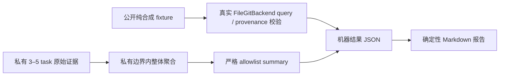

# 评测基线与私有试点协议

## 1. 目标与边界

本协议固定当前 File/Git、无成长增强工作流的比较基线。它回答“后续变化相对当前行为是否更好”，不声称一次试点具有统计普适性，也不把更多 Agent、更长上下文或更高活动量当作产品成果。



本 Issue 不实现 Shadow Evaluation、分层召回、Context Packet、自动晋升或新 Provider。公开 fixture 是合成评测输入，不是可召回的组织知识，也不得复制到真实权威知识库。

## 2. 版本化产物

| 产物 | 作用 |
|---|---|
| `evaluation/contracts/baseline-contract.v1.json` | 指标的分子、分母、方向、阈值、未定义条件和混杂因素 |
| `evaluation/schemas/synthetic-suite.v1.schema.json` | 公开合成 File/Git 输入契约 |
| `evaluation/schemas/private-pilot-summary.v1.schema.json` | 只允许整体聚合字段的私有试点出口 |
| `evaluation/schemas/evaluation-result.v1.schema.json` | 统一机器结果契约 |
| `evaluation/fixtures/synthetic-suite.v1.json` | 全局/项目、跨项目同名、角色/类型、状态、冲突、过期 Commit/Hash 的纯合成覆盖 |
| `evaluation/baselines/file-git-no-enhancement.v1.json` | 当前基线机器证据 |
| `evaluation/baselines/file-git-no-enhancement.v1.md` | 由同一机器结果确定性生成的人类摘要 |

Runner 会在临时目录创建独立合成 Git 仓库，固定提交身份和时间，实际调用当前 `FileGitBackend.query(...)` 与 `read_authoritative(...)`。作用域、状态、HEAD 可验证性不是 fixture 中硬编码的“预期答案”。冲突 fixture 刻意显示当前平面 File/Git 查询的基线缺口，但不在本 Issue 中实现冲突消解。

## 3. 指标解释

完整定义以版本化 contract 为准。结果分为三类：

| 类别 | 指标 | 判定原则 |
|---|---|---|
| 产品结果 | manager intervention、QA catch、rework、valid reuse、false recall | 只能组合比较，不能单项宣布改进 |
| 安全门禁 | scope leakage、stale/obsolete acceptance、provenance probes | 零容忍；缺字段、零分母或无法验证均使运行无效 |
| 诊断遥测 | context tokens、latency | 必须与质量并列，不是通过证据 |

延迟采用 median 与 nearest-rank p95，比较容差为 25%。公开 fixture 的延迟是明确版本化的合成输入，用于结果/报告可重现性，不冒充机器基准。私有试点应固定同一机器、运行时、模型、网络条件和 warm-cache 口径；操作系统、CPU、文件系统、冷热缓存和并发负载均是混杂因素。跨环境超出容差时只标记不可比较，不降低安全阈值。

## 4. 公开合成基线

生成临时结果：

```text
python scripts/evaluation_baseline.py synthetic --output <temporary-result.json> --report <temporary-report.md>
```

验证已提交结果与报告逐字节可重现：

```text
python scripts/evaluation_baseline.py verify
```

排序由稳定 ID 和当前 File/Git 查询顺序决定；输入使用 UTF-8，输出固定 LF、无时钟字段、无主机路径和随机运行 ID。Windows/Linux CI 都执行 `verify`。Markdown 只从机器结果生成，不能手工修饰成不同结论。

## 5. 私有 3–5 task 试点

### 5.1 任务选择

在一个真实项目中选择 3–5 个具有不同风险和工作类型、但范围可在一次交付内闭合的任务。先固定 task 范围、验收 oracle、计数规则、运行时/模型版本、机器和 warm-cache 口径，再运行当前无增强工作流。不要为了结果好看而在试点中途改分母或删除失败任务。

### 5.2 私有原始证据

逐任务源码、项目名、人员名、对话、路径、日志、Hook 数据、运行标识、知识正文和逐任务结果只能保存在该项目批准的私有证据边界；不得进入：

- 本公开仓库或公开 CI Artifact；
- 插件安装缓存；
- OPC canonical knowledge；
- Mem0 或其他召回索引。

在私有边界内完成计数和分布计算后，只导出 `private-pilot-summary.v1` 的整体聚合。生成不可读出项目含义的 12 位十六进制 `pilot_id`；不要使用项目简称。Schema 和 runner 都拒绝额外字段，因此项目名、自由文本、路径、逐任务数组和 artifact 引用不能混入输出。

### 5.3 聚合验证

复制纯合成模板到仓库外，替换整体计数和分布，然后运行：

```text
python scripts/evaluation_baseline.py private-summary --summary <aggregate.json> --output <result.json> --report <report.md>
```

Runner 要求 3–5 tasks、所有质量分母大于零、计数自洽，并对 scope leakage 与 stale/obsolete acceptance 保持零容忍。输入和机器输出必须是严格 JSON，`NaN`、`Infinity` 及其他非有限数一律拒绝。对 3–5 tasks，nearest-rank p95 必然是最大样本；runner 会在不重建或保留逐任务数据的前提下，验证 `total`、`median` 和 p95 是否可能来自对应数量的正数样本（context token 还必须满足正整数样本约束）。无法证明聚合可实现时按失败关闭，不得输出 PASS。若真实试点没有 QA defect、recall opportunity 或 accepted recall，当前小样本不能计算完整基线，应报告“无效/需补充任务”，不得把零分母转成 PASS。

## 6. 比较与发布解释

后续反馈、冲突治理或 Context Packet 实验必须复用同一 contract 和 fixture 版本；若改变指标定义，应发布新 contract/schema/baseline 版本，不能覆盖 v1。比较至少同时展示安全、质量、context cost 和 latency，并保留任务选择、顺序效应、学习效应和人工 oracle 偏差等限制。此基线只提供比较坐标，不自动批准知识、功能或 Release。
