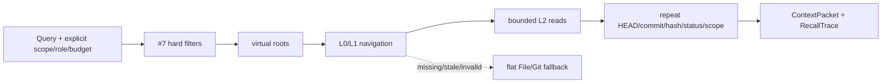

# 分层召回与 ContextPacket

## 契约与边界

| 层 | 内容 | 可否作为事实 | 存储 |
|---|---|---:|---|
| L0 | 已批准条目的 canonical `summary` 与导航元数据 | 否 | private derived index |
| L1 | 子节点类型、关键词和摘要的确定性聚合 | 否 | private derived index |
| L2 | current-HEAD canonical File/Git bytes | 是，通过完整治理后 | canonical knowledge |

虚拟路径为 `opc://global/{type}/{id}` 与 `opc://projects/{project_id}/{type}/{id}`。路径只表达显式 scope，不从工作目录、用户主目录或绝对路径猜测 project identity。



## CLI

所有命令都要求显式 canonical knowledge 与 private data root：

```text
python <plugin-root>/scripts/opc_hierarchical.py \
  --knowledge-root <knowledge-root> --data-root <private-data-root> index-preview
```

确认 preview 的 exact token 后：

```text
python <plugin-root>/scripts/opc_hierarchical.py \
  --knowledge-root <knowledge-root> --data-root <private-data-root> \
  index-build --approval-token <exact-token>
```

查询：

```text
python <plugin-root>/scripts/opc_hierarchical.py \
  --knowledge-root <knowledge-root> --data-root <private-data-root> query "deployment" \
  --project-id <project-id> --role developer --type decision \
  --allow-sensitivity internal --budget-tokens 2000
```

删除同样先 `index-delete-preview`，再对未变化 token 执行 `index-delete`。删除只影响 derived index，不修改 canonical knowledge、Provider index、项目源代码或 Git。

## 降级矩阵

| 情况 | 结果 |
|---|---|
| index 缺失/非法/HEAD 过期 | flat File/Git，并在 trace 标明 fallback |
| Provider 未安装或 disabled | File hierarchy |
| Provider timeout/error | File hierarchy，本次 trace 标明 provider fallback |
| Provider 返回越权/陈旧 ID | 丢弃该 ID，File hierarchy 继续 |
| L2 在导航与注入之间变化 | `l2_revalidation_failed`，正文不进入 packet |

## 公开评测

`hierarchical-recall-comparison.v1` 使用同一 public synthetic corpus 同时驱动当前 flat 与 hierarchical 实现。它覆盖 global、两个主要 project ID、role/type、approved/obsolete、未解决冲突、过期 index、相似但越权条目、跨目录 procedure 与 relations。

当前提交结果：precision@5 `0.20 → 1.00`，canonical leaf recall@5 均为 `1.00`，median injected tokens `661 → 107`（下降 `83.81%`），scope leakage 与 stale/obsolete acceptance 都为 `0`。实际本机延迟单独保存在 versioned artifact；它不是跨机器性能承诺，也不参与 golden byte 重测。完整结果见[评测报告](../evaluation/baselines/hierarchical-recall-comparison.v1.md)。
