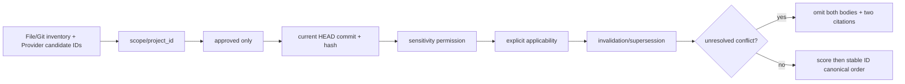

# 知识治理契约

`knowledge-governance-contract.v1.json` 是 File/Git recall、可选 Provider 候选召回、curator 与 Shadow consumer 之间的版本化边界。它不包含真实组织知识；公开仓库中的 schema、契约和测试数据均为合成资产。

## 1. Schema 兼容性

| 版本 | 读取 | 新建 | 治理字段写入 |
|---|---:|---:|---:|
| Schema 1 | 支持 | 否 | 先显式迁移 |
| Schema 2 | 支持 | 是 | 通过 preview/token curation |

Schema 2 在旧字段上增加 `sensitivity`、`applicability` 与 `relations`。JSON、字段数、文本、数组、关系数和每个状态目录中的记录数都有硬上限；非有限数值、额外字段、非 portable ID/ref、symlink、reparse point、hard link 或超限输入均 fail closed。

## 2. 确定性 context 筛选



缺少 `project_id` 时仅 global 条目可用。调用方必须通过 `--role`、`--applicability key=value` 和一个或多个 `--allow-sensitivity` 显式声明上下文；未声明但记录要求的字段不会被猜测。Provider score 不能跳过任何门禁，也不能改变 canonical 排序。

示例：

```text
python <plugin-root>/scripts/opc_memory.py query-context "deployment" \
  --knowledge-root <knowledge-root> --project-id portable-project \
  --role developer --applicability platform=linux \
  --allow-sensitivity internal
```

结果中的 `records` 才能进入执行上下文。`conflicts` 和 `omissions` 只包含 reason code 与 canonical citation；未解决冲突的双方正文都不会出现。关系目标缺失、有向环或目标不合格只隔离相关记录，不影响无关系的有效记录。

## 3. Schema 1 → 2 迁移

迁移默认零写入，且备份目录必须由用户预先创建在 canonical knowledge 外：

```text
python <plugin-root>/scripts/opc_memory.py migrate-schema --dry-run \
  --knowledge-root <knowledge-root> --backup-root <private-backup-root>
```

上述命令用于 inventory。选择单条记录后，必须带该 ID 再做一次单条 preview；apply 使用同一记录、同一备份目录和这次单条 preview 返回的 exact token：

```text
python <plugin-root>/scripts/opc_memory.py migrate-schema --dry-run \
  --knowledge-root <knowledge-root> --backup-root <private-backup-root> \
  --record-id <id>
```

```text
python <plugin-root>/scripts/opc_memory.py migrate-schema --apply \
  --knowledge-root <knowledge-root> --backup-root <private-backup-root> \
  --record-id <id> --plan-token <exact-token>
```

apply 在任何 canonical 写入前保存原始 Schema 1 bytes；source hash、目录 identity 或 token 改变时拒绝执行。迁移不会写 Provider，也不会自动 stage/commit。成功后只审查并提交返回的 `transition_paths`。已是 Schema 2 的条目重复执行为幂等 skip。

## 4. 关系与状态 curation

关系不是自由文本。每条关系必须提供 `kind`、`target_id`、`scope` 和相应 `project_id`。先 preview exact proposal：

```text
python <plugin-root>/scripts/opc_memory.py curate <id> --dry-run \
  --knowledge-root <knowledge-root> \
  --manager-approval <portable-approval-ref> \
  --set-status approved --validation <evidence-ref> \
  --relation '{"kind":"conflicts","target_id":"<target-id>","scope":"global","project_id":null}'
```

经理批准的必须是这一个 preview。apply 时所有 proposal 参数和 `--plan-token` 必须完全相同；任何 canonical source 变化都会得到 `CURATION_PLAN_CHANGED`。成功结果给出精确 `git_stage_pathspecs`，只允许提交这些路径。curation 不会自动写 Mem0；exact Git commit 可被当前 HEAD 验证后，才可另行 preview/批准 reindex。

## 5. Consumer 边界

| Consumer | 可以 | 不可以 |
|---|---|---|
| File/Git recall | 执行完整 hard filter，输出正文或脱敏 omission | 接受未发布、冲突、过期或越界正文 |
| Mem0/其他 Provider | 建议候选 ID | 决定 authority、过滤或排序 |
| Shadow Evaluation | 对 current-HEAD candidate 生成只读证据 | curation、关系消解、自动批准 |
| Curator | preview/apply 精确迁移与关系/状态变更 | 批量隐式迁移、宽路径 commit、Provider 写入 |

完整架构决策见 [ADR-0011](adr/0011-deterministic-knowledge-governance.md)，记忆层总体边界见[记忆架构](memory-architecture.md)。
