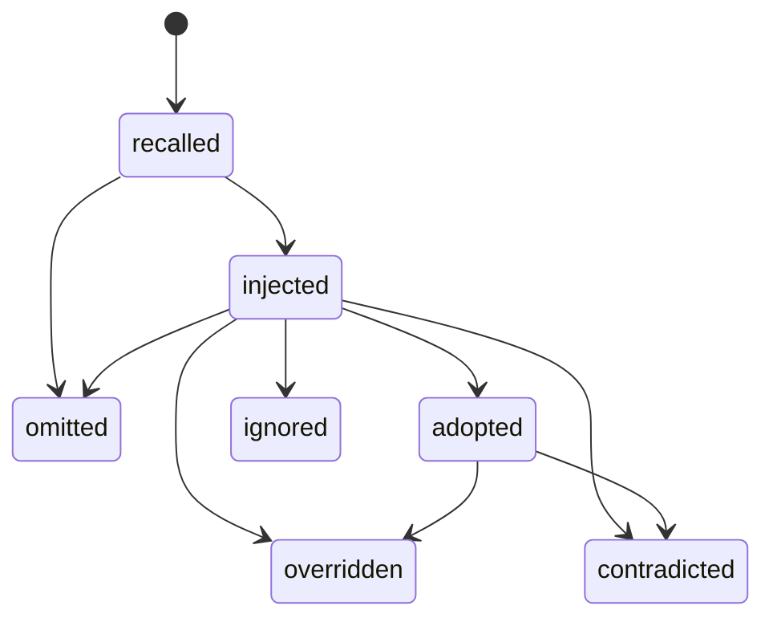

# 上下文与知识使用链路

知识链路回答“哪个角色在何步骤被提供了哪一版知识，后来记录了什么状态和证据关联”，不回答“这条知识导致了结果”。公开契约位于 `plugins/codex-opc-team/assets/lineage/`，运行时为 `plugins/codex-opc-team/scripts/opc_lineage.py`。

## 1. 数据模型

| 对象 | 固定身份 | 不包含 |
|---|---|---|
| Project/Run instance | Schema version + 原始文件 SHA-256 | title、notes、正文副本 |
| ContextPacket instance | `opc-context-packet-v1` + 规范 JSON SHA-256 | Packet body |
| RecallTrace instance | `opc-recall-trace-v1` + 规范 JSON SHA-256 | prompt、聊天、canonical body |
| Canonical revision | ID、relative source path、HEAD commit、content SHA-256、status、scope/project、type、sensitivity | 知识正文 |
| Role/step state | portable role、step、前驱 event、明确状态 | inferred adoption |
| Evidence association | QA/feedback/outcome/shadow/evaluation 的 relative ref + file SHA-256 | artifact body |

状态机是确定性的：



`recalled`、`injected` 和 `adopted` 是三个事实，不互相推断。Lineage v1 的 `recalled` 也必须精确匹配 ContextPacket citation 的 path/commit/content Hash/治理字段；ID-only RecallTrace 的 `canonical_reads` 或 discard 不能证明某个 revision。`provider` 和 `association` 是不同事件类型，不参与知识状态机。Evidence ref 只允许出现在 `association` 事件；knowledge/provider 事件必须使用空数组。

## 2. Preview 与写入

事件输入只允许固定字段，不接受自由文本。知识事件还要提供由当前 `opc_hierarchical.py query` 产生的完整 RecallResult 文件；运行时先执行 Packet/Trace 单体与联合 validator，再只保存版本与 Hash。

```text
python <plugin-root>/scripts/opc_lineage.py preview \
  --project-root <project> --knowledge-root <knowledge-root> \
  --event-file <private-event.json> --recall-result-file <private-recall.json> \
  --expected-revision 0

python <plugin-root>/scripts/opc_lineage.py record \
  --project-root <project> --knowledge-root <knowledge-root> \
  --event-file <private-event.json> --recall-result-file <private-recall.json> \
  --expected-revision 0 --plan-token <exact-preview-token>
```

Preview 零写入，并把 base sidecar 的存在性、原始文件字节 SHA-256 和 project/run 的 exact subject binding（ID + instance Hash）纳入 exact plan token。Record 会在同一进程内重新执行 preview，并继续持有 project root 与 `.opc` 的目录对象绑定，同时记录 lineage 目录对象 identity 或“尚不存在”；打开 lineage、创建 lock、创建 pending/backup、atomic replace 和最终清理前都必须复验同一对象。目录 rename、同字节替换、symlink/junction/reparse 或 ancestor identity 变化一律 fail closed；Windows 8.3 等价别名按 `samefile` identity 接受。目录 token、inode、handle、绝对路径只存在于该次进程内绑定，不进入 plan token 的公开 core、record、view、report 或日志。

Record 的 sidecar 与 lock 路径始终从该绑定 run 派生；锁内及发布前重读 project/run 并逐字段比对，主体切换或路径错配一律 fail closed。Git worktree 必须把整个 `.opc/lineage/` 目录设为 ignore 且目录中没有 tracked 内容；只 ignore 最终 JSON 的窄规则不够，因为 final、lock、pending、backup transaction artifacts 都必须落在同一私有边界。Record 使用 base-record CAS + revision CAS、独占 lock、BoundDirectory、单链接检查、随机 pending/backup、`fsync` 和 atomic replace，并在创建 lock 前、写事务产物前和 replace 前复验隐私边界；锁内 base 缺失、出现或同 revision 内容变化都拒绝覆盖。Git worktree/ignore/tracked 探测不可用、超时或异常结果一律 fail closed，只有明确的 non-Git 结果可使用项目私有边界。相同 event ID 与相同内容重试为幂等；不同内容或 stale revision 拒绝。所有目录 handle/fd 必须在成功、预览失败、锁冲突、主体变化、`KeyboardInterrupt`/`SystemExit` 取消或发布回滚后由既有 owner 的 `finally` 关闭，不得阻止后续合法 rename/delete；取消若发生在 replace 后，事务必须先恢复旧 sidecar 或删除本次新建 sidecar。不要把 event/recall 临时文件放进公开仓库、canonical knowledge 或项目源码。

## 3. Provider 降级与 no-memory

| Provider state | 记录 | File/Git 核心 |
|---|---|---|
| `available` | 非降级 provider event | 继续 |
| `missing / disabled / failed / stale` | 必须有 portable reason code | 继续并显示 degraded |
| `no_memory` | 明确表示可选 memory 未使用 | 继续，不伪造 recall/usage |

Provider 不是 authority。降级 trace 不得写成“知识被采用”或“Provider 改善了结果”。

## 4. 报告前重验

```text
python <plugin-root>/scripts/opc_lineage.py show --project-root <project> --knowledge-root <knowledge-root>
python <plugin-root>/scripts/opc_lineage.py report --project-root <project> --knowledge-root <knowledge-root>
```

`show` 输出机器 view；`report` 从同一 view 确定性渲染 Markdown。每次生成 view 都重新验证：

1. canonical relative source path 仍指向单一 File/Git record；
2. citation commit 是当前 HEAD provenance，内容 Hash 相同；
3. status 仍为 approved，scope/project 匹配；
4. role applicability、sensitivity、invalidation/supersession、conflict 仍通过 #7 治理；
5. evidence ref 位于 `.opc` 私有边界，存在、bounded、single-link、Hash 相同；feedback/outcome 和 Shadow 还执行各自 runtime validator。

任何 stale、cross-project、obsolete、conflict、缺失或验证失败都只产生 omission/degraded，不制造 usage。报告固定包含：

> association/evidence only — this report does not establish causal contribution.

并固定列出角色能力、任务难度、环境变化、QA/经理干预等 confounders，以及 counterfactual 和未观察上下文等 unknowns。

## 5. 兼容、保留与删除

v0.1 run 没有 lineage sidecar 时仍可读取，显示 `lineage unavailable`；不修改旧 `run.json`，无需迁移。不能把“没有 sidecar”解释为 no-memory、未使用或使用成功。

Lineage 是 `private-derived-run-evidence`，默认保留 30 天，项目策略可缩短。需要 redaction 时删除整个 `.opc/lineage/<run_id>.json` 派生产物；不要改写 canonical knowledge、Provider index 或 Git 历史来“清理”链路。备份与保留由项目私有数据策略负责。

禁止保存 raw chat/prompt、CoT、Hook/tool payload、凭据、embedding、session/turn/thread ID、用户主目录、正文或私有 artifact body。链路记录不自动批准、拒绝、改写、晋升或发布知识，也不创建 remote telemetry。
