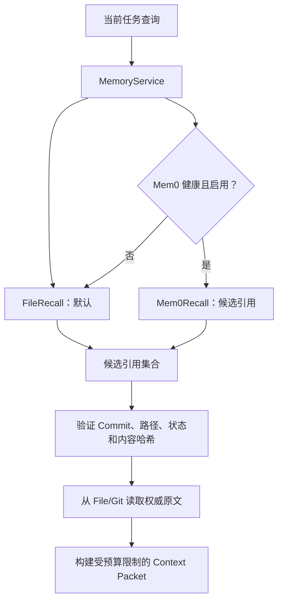
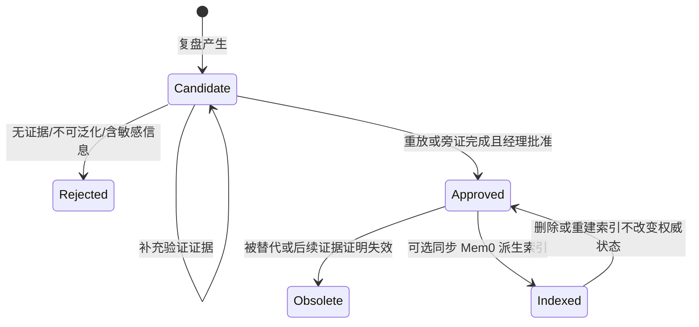

# 记忆架构

## 1. 记忆解决的是连续性，不是无限存储

OPC 记忆的目标是让团队在正确时机拿到相关、可信且仍有效的上下文，并能解释这条知识从哪里来。原始聊天和所有运行日志不是天然的长期记忆；未经筛选地保存它们会增加隐私风险和上下文噪声。

## 2. 三类知识

| 类型 | 示例 | 主要用途 |
|---|---|---|
| 语义记忆 | 用户偏好、项目技术栈、稳定约束 | 认识经理和项目 |
| 情节记忆 | 某次决策、故障、解决过程和结果 | 恢复项目连续性与寻找先例 |
| 程序记忆 | 已验证的开发流程、验收模板、故障处理步骤 | 重复使用有效做法 |

知识条目至少应包含：稳定 ID、类型、摘要、适用范围、正文或权威引用、来源、创建时间、状态、验证证据、版本/Commit 和内容哈希。可以增加失效时间、替代关系和敏感级别。

## 3. 双层设计

本节的 `KnowledgeRepository`、`FileRecallProvider`、`Mem0RecallProvider` 和 `ContextPacket` 是概念责任名。v0.1 的实际实现分别是 `FileGitBackend`、其 `query(...)` 基线检索、`Mem0Provider` 和 `MemoryService.export_decision_context(...)` 输出的 Markdown 子集；完整方法映射见[架构](architecture.md#6-概念契约与-v01-实际-api)。



| 层 | 定位 | 可否独立删除 |
|---|---|---:|
| File/Git KnowledgeRepository | 权威事实、历史和治理记录 | 否，除非用户明确删除自己的知识 |
| FileRecallProvider | 无额外依赖的基线查找 | 可由同等基线实现替换 |
| Mem0RecallProvider | 可选语义索引，加速相关候选发现 | 是，可从权威知识重建 |

Mem0 索引会接收已批准条目的摘要和正文，并保存指向权威条目的路径、Commit 和内容哈希元数据。它返回的是“可能相关的候选引用”，不是可以直接注入上下文的事实。引用必须通过状态、Revision/Commit 和内容哈希验证，再从 File/Git 回读原文。

## 4. 为什么 File/Git 是权威源

- 可阅读、可导出，不依赖某个数据库或服务；
- 每次变更有 Diff、作者/批准者和回滚路径；
- Schema 与内容能一起审查；
- 便于将公开模板与私人实例分离；
- Mem0 或其他索引故障时，知识不会消失。

Git 并不意味着用户必须公开知识库。默认应是用户本地私有仓库，是否同步到私人远端由用户决定。

`project` 范围的条目必须带 `project_id`，只允许在相同项目上下文中召回；没有项目上下文时只返回 `global` 范围。语义相似度不能越过这条边界。经理批准只会把条目迁移为 `approved`，不会立即发布或写入 Mem0。策展流程只提交该条目涉及的旧/新路径；Git 提交成功且当前 HEAD 能在 canonical 路径验证同一内容哈希后，条目才是 Published，并具备可供 File 召回与派生索引验证的 Commit provenance。

## 5. Mem0 的可选语义

### 5.1 未安装时

系统直接使用 File/Git 元数据、作用域过滤和文本查找。核心流程、QA 和复盘不得被阻塞，也不应该在每次任务中反复提醒安装。

### 5.2 用户明确安装后

安装引导应：

1. 解释会增加什么能力、数据写到哪里、可能需要什么模型/凭据；
2. 显示计划变更，不静默安装；
3. 使用隔离环境和插件私有数据目录；
4. 只索引已批准、允许进入索引的条目；
5. 运行健康检查和小规模召回验证；
6. 支持随时禁用和删除索引而不影响 File/Git 知识。

`v0.1.0` 锁定并验证 `mem0ai==2.0.11`。这只是适配器兼容版本，不代表默认数据流完全本地；`v0.1` 使用 Mem0 默认的 OpenAI-backed LLM/Embedder，已批准条目的摘要和正文可能发送给 OpenAI 模型/嵌入服务，并可能需要 OpenAI 凭据。启用前必须明确展示这条数据流并由用户选择。完全本地 Provider 配置不在本版承诺内。

### 5.3 故障时

| 情形 | 行为 |
|---|---|
| 包未安装 | `status` 报告 `installed=false` 和 `health=unavailable-file-fallback`，基线继续 |
| 已安装但禁用 | 标记 `disabled`，不启动、不访问数据 |
| 配置/凭据缺失 | Doctor 给出操作建议，当前任务降级 |
| 调用超时或异常 | 本次熔断并降级，不将空结果写回权威层 |
| 索引结果过期 | 丢弃并安排可选重建，不注入旧内容 |
| 用户卸载 Mem0 | 删除隔离环境/索引需单独确认，保留知识库 |

## 6. Context Packet 概念形状

长期目标中，召回的最终产物不是一堆文档，而是受预算和来源约束的上下文包：

```text
ContextPacket
├─ query                 当前目标和检索条件
├─ project_facts[]       当前项目权威事实
├─ decisions[]           仍生效的相关决策
├─ experiences[]         相关且获批的先例
├─ procedures[]          已验证流程
├─ conflicts[]           相互冲突或待确认的信息
├─ citations[]           文件、Commit、Hash
└─ omitted_summary       因预算或敏感边界未注入的说明
```

v0.1 尚未发布独立 `ContextPacket` 类型；`MemoryService.export_decision_context(...)` 当前输出经作用域、批准状态和 canonical 来源验证后的 Markdown 决策上下文。上述 `project_facts/conflicts/omitted_summary` 等完整字段是后续演进方向，不应被解读为 v0.1 已提供的序列化 Schema。

排序建议依次考虑：作用域匹配、状态、时效、证据强度、语义相关度和上下文成本。语义相似度不能覆盖更强的作用域和有效性规则。

## 7. 反馈到成长的受控流程



持久状态统一为 `candidate / approved / rejected / obsolete`；验证过程、Published 条件和 Mem0 索引状态是流程或派生状态，不另造权威事实。候选经验和未能由当前 Git HEAD 验证的 approved 条目不能被正常召回为规则。只有 `approved`、当前 HEAD 中 canonical blob 与内容哈希一致、且适用范围匹配的知识可以注入执行上下文；`obsolete` 通过原因和 `superseded_by` 关系保留历史解释。

## 8. 冲突、失效和回滚

当新候选与现有知识冲突时，不自动覆盖。策展流程需要记录：冲突条目、差异、适用环境、各自证据、建议关系（替代/并存/拒绝）。发布后若发现有害影响，通过新 Commit 将条目标记失效或恢复前一版本，再重建受影响索引。

## 9. 隐私与最小化

- 原始对话、完整终端输出和 Hook 事件默认不进入知识库；
- 写入前进行字段级脱敏和作用域分类；
- 召回时只向当前角色提供完成任务所需片段；
- 外部嵌入或模型服务必须由用户显式选择，并说明数据边界；
- 公开仓库只有空白 Schema 和合成示例；
- Mem0 索引目录、虚拟环境和配置不得进入插件包或用户项目 Git。

## 10. 健康状态

`doctor` 或等效检查应分别报告：Knowledge Repo 可读/可写/版本状态、Git 工作区状态、FileRecall 状态、Mem0 安装/启用/健康状态、索引 Revision，以及发现问题后的精确修复建议。降级是显式状态，不应伪装成完整语义召回。

已知历史运行文件不属于知识变更。`status`/`doctor` 以 `LEGACY_RUNTIME_ARTIFACTS` 单独报告 `evaluations/events` 下的非占位文件和已知 `hook-events.jsonl` 路径，不读取文件内容，也不将它们计入 `UNCOMMITTED_KNOWLEDGE`。来源无法由公开 Git 历史证明时必须明确标记为 `unresolved_historical`。处理默认使用 `legacy-events --dry-run`；只有预览未变化且用户另行批准后，才可使用返回的 plan token 把未跟踪普通文件移入隔离的 `data_root/legacy-event-archive`。该流程不自动删除、提交或上传数据。
