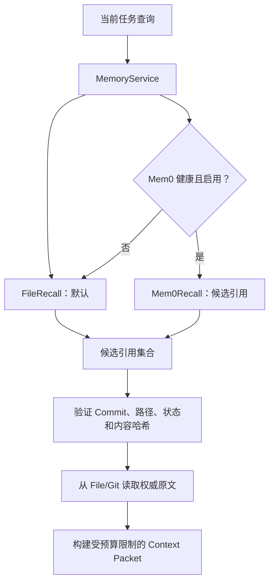
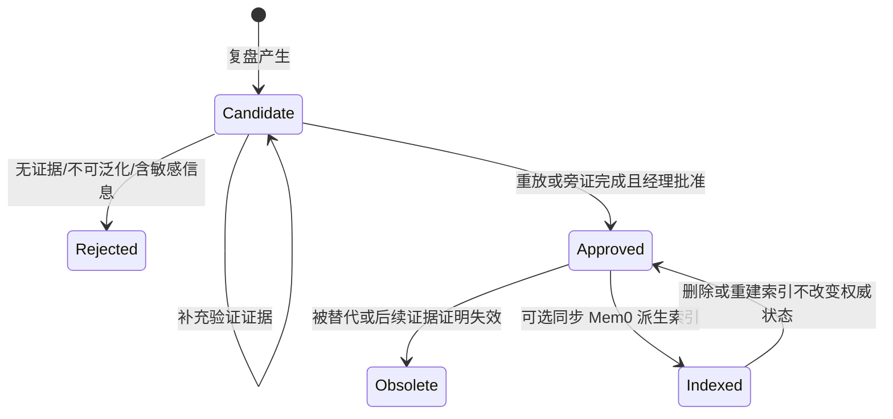

# 记忆架构

## 1. 记忆解决的是连续性，不是无限存储

OPC 记忆的目标是让团队在正确时机拿到相关、可信且仍有效的上下文，并能解释这条知识从哪里来。原始聊天和所有运行日志不是天然的长期记忆；未经筛选地保存它们会增加隐私风险和上下文噪声。

## 2. 三类知识

| 类型 | 示例 | 主要用途 |
|---|---|---|
| 语义记忆 | 用户偏好、项目技术栈、稳定约束 | 认识经理和项目 |
| 情节记忆 | 某次决策、故障、解决过程和结果 | 恢复项目连续性与寻找先例 |
| 程序记忆 | 已验证的开发流程、验收模板、故障处理步骤 | 重复使用有效做法 |

知识条目至少应包含：稳定 ID、类型、摘要、适用范围、正文或权威引用、来源、创建时间、状态、验证证据、版本/Commit 和内容哈希。Schema 2 还用严格字段表示敏感级别、角色/类型/约束/有效期适用性，以及冲突、替代和失效关系；完整契约见[知识治理契约](knowledge-governance.md)。

## 3. 双层设计

本节的 `KnowledgeRepository`、`FileRecallProvider`、`Mem0RecallProvider` 和 `ContextPacket` 是概念责任名。v0.1 的实际实现分别是 `FileGitBackend`、其 `query(...)` 基线检索、`Mem0Provider` 和 `MemoryService.export_decision_context(...)` 输出的 Markdown 子集；完整方法映射见[架构](architecture.md#6-概念契约与-v01-实际-api)。



| 层 | 定位 | 可否独立删除 |
|---|---|---:|
| File/Git KnowledgeRepository | 权威事实、历史和治理记录 | 否，除非用户明确删除自己的知识 |
| FileRecallProvider | 无额外依赖的基线查找 | 可由同等基线实现替换 |
| Mem0RecallProvider | 可选语义索引，加速相关候选发现 | 是，可从权威知识重建 |

Mem0 索引会接收已批准条目的摘要和正文，并保存指向权威条目的路径、Commit 和内容哈希元数据。它返回的是“可能相关的候选引用”，不是可以直接注入上下文的事实。引用必须通过状态、Revision/Commit 和内容哈希验证，再从 File/Git 回读原文。

## 4. 为什么 File/Git 是权威源

- 可阅读、可导出，不依赖某个数据库或服务；
- 每次变更有 Diff、作者/批准者和回滚路径；
- Schema 与内容能一起审查；
- 便于将公开模板与私人实例分离；
- Mem0 或其他索引故障时，知识不会消失。

Git 并不意味着用户必须公开知识库。默认应是用户本地私有仓库，是否同步到私人远端由用户决定。

`project` 范围的条目必须带 `project_id`，只允许在相同项目上下文中召回；没有项目上下文时只返回 `global` 范围，绝不从工作目录或绝对路径推断项目。语义相似度不能越过这条边界。正常 context 固定依次检查 scope/project、approved、当前 Git HEAD 验证的 canonical blob 与 commit/hash、sensitivity、显式 applicability、invalidation/supersession；Provider 只建议候选 ID，分数不能改写门禁或 canonical 排序。未解决冲突的双方正文都不进入上下文，只返回双方 canonical citation。经理批准只会把条目迁移为 `approved`，不会立即发布或写入 Mem0。策展流程只提交该条目涉及的旧/新路径；Git 提交成功且当前 HEAD 能在 canonical 路径验证同一内容哈希后，条目才是 Published，并具备可供 File 召回与派生索引验证的 Commit provenance。

## 5. Mem0 的可选语义

### 5.1 未安装时

系统直接使用 File/Git 元数据、作用域过滤和文本查找。核心流程、QA 和复盘不得被阻塞，也不应该在每次任务中反复提醒安装。

### 5.2 用户明确安装后

安装引导应：

1. 解释会增加什么能力、数据写到哪里、可能需要什么模型/凭据；
2. 显示计划变更，不静默安装；
3. 使用隔离环境和插件私有数据目录；
4. 只索引已批准、允许进入索引的条目；
5. 运行健康检查和小规模召回验证；
6. 支持随时禁用和删除索引而不影响 File/Git 知识。

`v0.1.0` 锁定并验证 `mem0ai==2.0.11`。这只是适配器兼容版本，不代表默认数据流完全本地；`v0.1` 使用 Mem0 默认的 OpenAI-backed LLM/Embedder，已批准条目的摘要和正文可能发送给 OpenAI 模型/嵌入服务，并可能需要 OpenAI 凭据。启用前必须明确展示这条数据流并由用户选择。完全本地 Provider 配置不在本版承诺内。

### 5.3 故障时

| 情形 | 行为 |
|---|---|
| 包未安装 | `status` 报告 `installed=false` 和 `health=unavailable-file-fallback`，基线继续 |
| 已安装但禁用 | 标记 `disabled`，不启动、不访问数据 |
| 配置/凭据缺失 | Doctor 给出操作建议，当前任务降级 |
| 调用超时或异常 | 本次熔断并降级，不将空结果写回权威层 |
| 索引结果过期 | 丢弃并安排可选重建，不注入旧内容 |
| 用户卸载 Mem0 | 删除隔离环境/索引需单独确认，保留知识库 |

## 6. Context Packet 概念形状

长期目标中，召回的最终产物不是一堆文档，而是受预算和来源约束的上下文包：

```text
ContextPacket
├─ query                 当前目标和检索条件
├─ project_facts[]       当前项目权威事实
├─ decisions[]           仍生效的相关决策
├─ experiences[]         相关且获批的先例
├─ procedures[]          已验证流程
├─ conflicts[]           相互冲突或待确认的信息
├─ citations[]           文件、Commit、Hash
└─ omitted_summary       因预算或敏感边界未注入的说明
```

`opc_hierarchical.py` 现已发布严格的 `opc-context-packet-v1` 机器产物：facts、decisions、experiences、procedures、canonical citations、不含冲突正文的 conflicts、显式 budget 与 omitted summary。配套 `opc-recall-trace-v1` 记录 root、expansion、discard/fallback、`canonical_reads`、final leaves 和 read/token cost，不记录正文或原始运行内容。两个产物还必须通过联合 validator 的 identity、citation、token/budget/read 交叉校验。原有 `MemoryService.export_decision_context(...)` 与 `query-context`/`FileGitBackend.query_context(...)` 继续作为兼容的 flat File/Git 表面。

分层正常路径使用与 flat 相同的共享 #7 冻结关系图引擎，并在导航前/L2 前以不暴露正文的 canonical governance metadata snapshot 绑定 private derived metadata，再用 `opc://global` / `opc://projects/{project_id}` 的 L0/L1 导航，只读取少量最终 L2 canonical bodies。snapshot 为 provenance 可扫描底层 canonical bytes，但严格跳过 `content` 的对象构造：正文不进入 Python 字符串、评分、Trace 或 Token 上下文；只有最终 L2 的 `read_authoritative(...)` 才 materialize 正文。每个 L2 在注入前重复 exact HEAD/commit/hash/status/scope/sensitivity/applicability/relations 验证。L0/L1、虚拟树和索引都不可作为事实；缺失、非法、过期或 governance mismatch 时显式降级 flat File/Git。完整契约见[分层召回与 ContextPacket](hierarchical-recall.md)和 [ADR-0012](adr/0012-hierarchical-file-recall-context-packet.md)。

hard filter 不参与排序权衡：作用域、状态、current HEAD、敏感授权、适用性和关系任一失败就排除。通过后才按文本相关度和稳定 ID 进行确定性排序；Provider rank 永远不参与 canonical 顺序。

## 7. 反馈到成长的受控流程



持久状态统一为 `candidate / approved / rejected / obsolete`；验证过程、Published 条件和 Mem0 索引状态是流程或派生状态，不另造权威事实。候选经验和未能由当前 Git HEAD 验证的 approved 条目不能被正常召回为规则。Schema 1 继续只读兼容；写入适用性、敏感级别或正式关系前，必须先 preview 单条 Schema 1→2 迁移、绑定外部私有备份和 exact token。状态/关系 curation 也必须 preview exact proposal 并由经理批准，且不自动写 Provider 或 Git。

`opc_shadow.py` 提供候选的只读 Shadow Evaluation：先验证 candidate 状态、project scope 与 current-HEAD exact blob，再用 #4 同一指标契约比较 control/treatment，并把 #5 feedback 按 measured、human judgment、model inference、unverified 分类。Shadow confidence 是派生报告字段，不回写候选，也不代表批准；任何 canonical transition、Git commit 和可选 reindex 仍由独立 curator 流程完成。详见[候选经验 Shadow Evaluation](shadow-evaluation.md)。

## 8. 冲突、失效和回滚

当新候选与现有知识冲突时，不自动覆盖。`conflicts` 会隔离双方正文并保留双方 citation；`supersedes/superseded_by` 与 `invalidates/invalidated_by` 只有在显式 scope/project identity 下生效。缺失目标、关系环或不合格目标只隔离相关节点。策展流程需要记录差异、适用环境、各自证据和 exact relation proposal；发布后若发现有害影响，通过新 Commit 将条目标记失效或恢复前一版本，再重建受影响索引。

## 9. 隐私与最小化

- 原始对话、完整终端输出和 Hook 事件默认不进入知识库；
- 写入前进行字段级脱敏和作用域分类；
- 召回时只向当前角色提供完成任务所需片段；
- 外部嵌入或模型服务必须由用户显式选择，并说明数据边界；
- 公开仓库只有空白 Schema 和合成示例；
- Mem0 索引目录、虚拟环境和配置不得进入插件包或用户项目 Git。
- 分层 L0/L1 索引只进入显式 private `data_root/.opc/derived/hierarchical-recall-v1`；preview 零写，build/delete 绑定 exact token，且拒绝任何 Git worktree、canonical knowledge 或 plugin overlap。

## 10. 健康状态

`doctor` 或等效检查应分别报告：Knowledge Repo 可读/可写/版本状态、Git 工作区状态、FileRecall 状态、Mem0 安装/启用/健康状态、索引 Revision，以及发现问题后的精确修复建议。降级是显式状态，不应伪装成完整语义召回。

已知历史运行文件不属于知识变更。`status`/`doctor` 以 `LEGACY_RUNTIME_ARTIFACTS` 单独报告 `evaluations/events` 下的非占位文件和已知 `hook-events.jsonl` 路径，不读取文件内容，也不将它们计入 `UNCOMMITTED_KNOWLEDGE`。来源无法由公开 Git 历史证明时必须明确标记为 `unresolved_historical`。处理默认使用 `legacy-events --dry-run`；只有预览未变化且用户另行批准后，才可使用返回的 plan token 把未跟踪普通文件移入隔离的 `data_root/legacy-event-archive`。该流程不自动删除、提交或上传数据。
