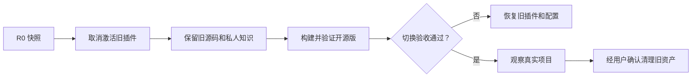

# 从本地原型迁移

## 1. 原则：先建立回滚，再取消激活，最后删除

旧原型包含可工作的行为和用户私人知识，同时也有硬编码配置和 Hook 越界记录风险。因此迁移采用受控蓝绿切换：先保留旧源码和知识作为“蓝色”回滚基线，在新公开仓库构建“绿色”版本；快照完成后取消旧插件激活，避免旧 Hook 继续采集；新版通过验收后才清理旧资产。



## 2. 对象分类

| 对象 | 迁移策略 |
|---|---|
| 旧插件源码 | 保留完整 Git 状态，用作选择性迁移源和回滚点 |
| 已安装 Personal 插件 | 快照后通过 Codex CLI 取消激活，不手删缓存 |
| 私人 `opc-knowledge` | 保留为用户数据，迁移 Schema 时先备份，不上传公共仓库 |
| Codex 全局配置 | 只处理可证明属于旧 OPC 的绝对路径/角色项 |
| 共享 Feature Flags | 不因 OPC 迁移而盲目关闭 |
| Personal Marketplace | 新版验证前保留；以后只移除 OPC 条目，不盲删整个文件 |
| Hook 原始日志 | 隔离、记录哈希和访问限制；不提交公开仓库 |

## 3. 阶段 M0：冻结与 R0 快照

在任何卸载或配置修改之前，形成只读迁移清单：

- Codex 版本、已安装插件列表和启用状态；
- 旧插件与知识库的 Git HEAD、Status 和文件清单；
- `config.toml` 与 Marketplace 配置的备份和 SHA256；
- OPC 专属角色、绝对路径和 Hook 信任项的精确位置；
- Hook 日志文件的大小、哈希和隔离位置；
- 恢复 Personal Marketplace 和旧插件的命令草案。

快照不得将凭据或私人知识复制到公开项目。备份放在用户控制的私有位置，并记录访问权限。

**Gate M0：** 能说明每个将被修改对象的原值、所有权和恢复方式。

## 4. 阶段 M1：取消旧版激活

使用 Codex Plugin CLI 移除/停用旧的 Personal 安装，然后开启新任务确认：旧 Skills 不再被发现；旧 Hook 不再产生事件；旧源码目录和知识库仍完整。

如果旧 Hook 继续运行，应暂停迁移并排查注册来源，不能带着重复或越界 Hook 进入新版本验证。

**Gate M1：** 新事件计数为零，私人数据未删除，旧插件可按快照重装。

## 5. 阶段 M2：选择性迁移到公开仓库

可以迁移：通用 Skill、角色职责、Hook 逻辑、Schema、空白模板、测试思路和经过脱敏的架构文档。

禁止整体复制：旧 `.git` 历史、真实知识条目、经理档案、运行日志、session/turn ID、作者本机路径、Token/凭据、插件缓存和仅用于本机刷新的版本字符串。

迁移 Hook 时必须先修复顺序：

```text
收到 Hook 事件
  → 定位项目和 Run Marker
  → 验证 Marker 存在、结构有效、任务匹配
  → 字段最小化与脱敏
  → 才允许写入 OPC 私有运行日志
```

任何验证失败都应安全退出且零记录。

**Gate M2：** 隐私扫描通过，Git 历史不含旧私人数据，代码不含维护者绝对路径。

## 6. 阶段 M3：知识库接入和 Schema Migration

新版首先以只读方式检查现有知识库：版本、Git 状态、目录约定、冲突和未跟踪运行文件。Migration 先生成计划和备份，再由用户确认；转换完成后验证条目数、Hash、引用关系和 Git Diff。

Hook 事件日志不是组织知识，不应因迁移进入受控知识层。对已有越界日志，先隔离和评估，再按用户明确指示决定保留用于安全审计或删除。

当前公开仓库只能确认首个提交已创建空的 `evaluations/events` 模板目录，不能确认真实 `hook-events.jsonl` 的写入来源；这类文件应标记为 unresolved historical provenance。使用 Memory CLI 时先执行：

```text
opc_memory.py --knowledge-root <knowledge-root> --data-root <data-root> legacy-events --dry-run
```

该命令不读取事件内容、不创建归档目录，也不移动文件。用户核对源/目标路径并单独批准后，才可使用预览返回的 token：

```text
opc_memory.py --knowledge-root <knowledge-root> --data-root <data-root> legacy-events --apply --plan-token <approval-token>
```

Apply 只移动未跟踪的普通文件到私有 `data_root/legacy-event-archive`；不删除、提交或上传。已跟踪文件、符号链接、目标冲突或跨文件系统场景保持原位并转人工处理。

**Gate M3：** 核心知识数量和内容一致；新 Schema 可读；回滚可恢复；公共仓库仍不含私人内容。

## 7. 阶段 M4：隔离验证新版

在临时 Codex Home 或等效隔离环境中验证公开仓库：

1. 从 Git Marketplace 安装固定版本；
2. 不安装 Mem0 完成完整 OPC 闭环；
3. 测试 Mem0 未安装、禁用、失败和索引过期降级；
4. 验证 Hook 只在有效 Run Marker 下记录；
5. 验证 install/uninstall 重复执行安全；
6. 执行“经理 → 总管 → 开发 → 独立 QA → 经理交接”正向测试；
7. 演练恢复旧 Personal 插件。

不要在同一个 Codex 环境同时激活旧版和新版同名 Skills，以免发现顺序掩盖问题。

**Gate M4：** [测试与验收](testing-and-acceptance.md)中的 G1–G7 全部通过。

## 8. 阶段 M5：正式切换

正式环境添加公开 Git Marketplace 并安装固定标签。根据预览 Diff 清理旧 OPC 专属配置，不修改共享 Feature。打开新任务运行 Doctor，再使用一个真实但可回滚的项目完成端到端验收。

**Gate M5：** 新版从公开来源运行；知识连续；独立 QA 有真实证据；旧 Hook 不重复触发。

## 9. 阶段 M6：观察与清理

至少经过一个代表性真实项目且没有回滚需求后，向用户展示待清理清单：旧源码、Personal Marketplace 中的 OPC 条目、私有备份保留期、隔离日志和可选旧索引。只有用户逐项确认后执行。

私人知识库默认长期保留，不属于“清理旧插件”的范围。

## 10. 回滚表

| 失败点 | 回滚动作 |
|---|---|
| 取消激活后新版无法安装 | 恢复 Marketplace 快照并重装 Personal 插件 |
| 全局配置变更导致发现异常 | 恢复 `config.toml` 备份并开启新任务 |
| Schema Migration 失败 | 停止写入，恢复知识库备份/Commit |
| Mem0 故障 | 禁用可选后端，继续 File/Git，不回滚权威知识 |
| 新 Hook 产生越界事件 | 立即停用插件、隔离日志、恢复无 Hook 基线并修复 |
| 真实项目 QA 失败 | 保留新版安装，按 FAIL 证据修复；若基础运行不可靠则恢复旧版 |

回滚完成也要验证：插件发现状态、Hook 事件、知识读取和一个最小项目流程，而不是只确认命令返回成功。
