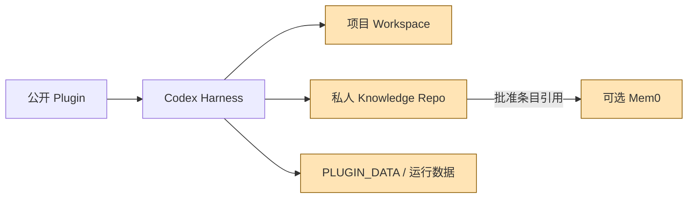
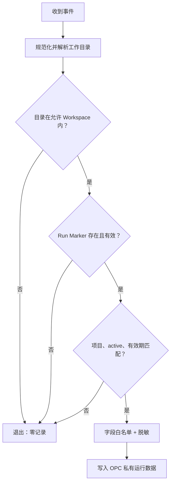

# 安全与隐私

## 1. 安全目标

OPC 会接触项目、偏好、决策和运行证据，长期价值越高，潜在泄露和记忆污染的影响也越大。安全目标包括：数据不越界采集；公开代码不携带私人内容；召回内容有来源且可验证；可选依赖失效不破坏基线；配置和卸载可审计、可恢复。

## 2. 数据分类

| 等级 | 示例 | 默认处理 |
|---|---|---|
| Public | Plugin 代码、Schema、空白模板、脱敏合成示例 | 可以进入公开仓库 |
| Private | 项目简报、经理偏好、组织经验、运行状态 | 只在用户私有项目/知识目录 |
| Sensitive | 原始对话、完整终端输出、session/turn ID、本机路径 | 默认不持久化；必要时最小化和限期保留 |
| Secret | API Key、Token、Cookie、私钥、认证配置 | 永不写入知识、日志和仓库；只通过安全环境提供 |

数据从高敏级别降为低敏级别必须经过明确脱敏和审核，不能因为“对调试有用”自动进入长期记忆。

## 3. 信任边界

公开插件不可信任项目内容可以外传；项目不应能通过伪造标记读取其他项目知识；Mem0 只能收到用户批准进入索引的数据；子 Agent 只得到当前委派所需上下文。

## 4. Hook 安全契约

本地原型暴露了关键风险：如果 Hook 在检查 `.opc/run.json` 或等效 Run Marker 之前记录事件，就会收集其他 Codex 项目的 cwd 和会话标识。

正确顺序是：

Hook 必须满足：

- 默认拒绝，验证失败零记录；
- 不跟随逃出 Workspace 的路径或符号链接；
- 采用字段白名单，不保存完整输入环境；
- session/turn ID 如非必要不保存；必要时使用短期、不可逆关联标识；
- 日志有大小、保留期和轮换策略；
- 日志路径位于 `PLUGIN_DATA/run-events` 或已验证项目的 `.opc` 回退中，被项目 Git 忽略，不在插件缓存、公共仓库或 File/Git 权威知识库；
- `PLUGIN_DATA` 缺失、无效或落入 `OPC_KNOWLEDGE_HOME` 时，必须回退项目 `.opc`，不得尝试在知识库中创建替代目录；
- Hook 崩溃不能阻塞普通非 OPC Codex 任务。

`v0.1` 的 Marker 默认有效期为 7 天；每次有效状态更新会续期。进入 `completed`、`paused` 或 `failed` 后 `active=false`，Hook 立即停止记录。事件文件单个最多 256 KiB，最多保留 3 个轮换文件，轮换文件保留期为 14 天。

## 5. 记忆污染防护

| 攻击/故障 | 防护 |
|---|---|
| 项目文件诱导写入永久规则 | 只允许复盘生成候选，需验证与批准 |
| 旧索引返回已修改条目 | 校验 Commit/Revision 和内容哈希，回读权威原文 |
| 相似度高但作用域不符 | 作用域、状态和时效优先于语义分数 |
| 候选包含凭据或个人数据 | 写入前分类、脱敏和拒绝规则 |
| 一个角色读取整库 | Context Packet 最小化，按项目/角色过滤 |
| Mem0 供应链或服务异常 | 隔离依赖、固定版本、可禁用、File/Git 降级 |
| Shadow replay 越界或诱导自动晋升 | current-HEAD/scope 预检、同契约比较、私有不可覆盖报告、零状态/索引写入 |
| derived 分层索引被删除、过期或篡改 | 只作导航；缺失/非法/HEAD 不同即 flat fallback；L2 注入前重验 exact provenance 与治理 |

Mem0 Adapter 在任何 `mem0` import 之前把 `MEM0_DIR` 指向 OPC 私有 `data_root`，显式关闭 `MEM0_TELEMETRY`，并固定 History DB 与 Qdrant 路径。若当前进程已经用外部目录或开启 Telemetry 导入 Mem0，Adapter 拒绝继续并降级到 File/Git。这些本地路径隔离不等于文本完全本地：进入索引的已批准摘要和正文可能发送给默认 OpenAI-backed 模型/嵌入服务。用户必须在启用前看到这条数据流；返回的召回项仍只是带 canonical 元数据的候选引用，必须回读 File/Git。

知识的批准记录应说明证据和适用范围。管理员仍需要能够通过 `obsolete` 状态、`obsolete_reason` 和可选 `superseded_by` 标记失效/替代关系，然后重建索引。

## 6. 配置与安装安全

插件核心不静默修改用户 `config.toml`。可选角色注册或 Hook 信任配置必须先展示精确 Diff，确认后备份和原子写入，并记录本插件拥有的键。卸载只移除所有权明确且未发生用户修改的条目。

安装脚本不得：下载并执行未固定版本的远程脚本、打印 Secret、把依赖安装到全局 Python、通过手删 Codex 缓存“完成安装”、或删除未知目录来实现清理。

## 7. 公开仓库隐私门

推送和发布前至少检查：

| 检查 | 阻断条件 |
|---|---|
| Secret Scan | Token、API Key、私钥、认证文件或高熵凭据 |
| 路径扫描 | 维护者用户名目录、盘符绝对路径、私有服务器路径 |
| 标识扫描 | 真实 session/turn/conversation ID、邮箱、电话 |
| 内容审查 | 真实经理档案、项目知识、原始对话、日志 |
| Git 历史 | 删除后的敏感文件仍存在于历史 |
| 构建产物 | 索引、虚拟环境、缓存、事件日志被打包 |

发现敏感内容不能只在最新提交删除；在首次公开前应重建干净历史。已经公开后按照安全事件流程处理并轮换可能泄露的凭据。

## 8. 数据生命周期

| 数据 | 创建 | 保留 | 删除 |
|---|---|---|---|
| 项目契约 | 项目启动 | 随项目策略 | 用户/项目维护者决定 |
| 批准知识 | 策展批准 | 长期、Git 可审计 | 通过失效/删除 Commit，不静默抹除历史 |
| 候选经验 | 复盘 | 到审核或过期 | 可按策略清理 |
| Hook 运行事件 | 有效 OPC 运行且确有必要 | 短期、轮换 | 自动策略或用户明确清理 |
| Mem0 索引 | 用户启用并索引 | 可重建 | 可独立删除，不影响知识 |
| 分层 L0/L1 索引 | 用户确认 exact preview 后在 private data root 构建 | 可重建、Git ignored | exact-token 删除，不影响知识或 Provider |
| Shadow Evaluation 输入/报告 | 用户批准的私有 pilot 或合成 fixture | 私有派生数据策略 | 用户按私有证据保留策略决定 |
| 配置备份 | 配置变更前 | 到用户确认稳定 | 明确列出后由用户决定 |

## 9. 安全事件响应

发生越界日志、公开泄露或记忆污染时：停止继续采集/发布；隔离受影响数据；保留最小审计证据；判断项目、用户和版本范围；轮换凭据；修复并建立回归测试；按 [SECURITY.md](../SECURITY.md) 协调披露。不得为了“清理干净”未经用户同意删除私人知识或审计证据。

对知识库中的 legacy 运行文件，诊断只查看路径元数据，不打开内容。归档先执行只读预览，再凭未变化的 plan token 和单独授权移动未跟踪普通文件；已跟踪文件、符号链接、已有目标或跨文件系统移动失败都必须停止并保留源文件。自动流程不得删除、提交或上传这些私人事件。
