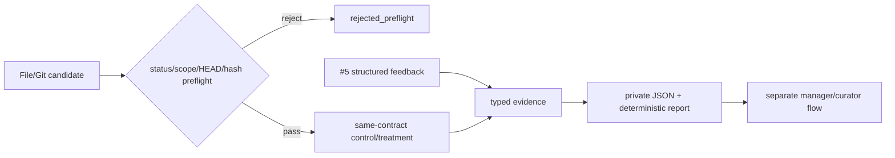

# 候选经验 Shadow Evaluation

## 1. 作用与边界

Shadow Evaluation 回答“在相同评测契约下，加入这个候选后是否出现可测的收益、无变化、伤害或冲突”。它不回答“是否批准”，也不修改知识或索引。



| Shadow 可以做 | Shadow 不能做 |
|---|---|
| 预检候选状态、scope、HEAD 与哈希 | 批准、拒绝、失效或改 confidence 字段 |
| 比较 #4 质量/安全/成本/延迟 | 写 canonical knowledge、Git 或 Provider index |
| 读取 #5 私有反馈并保留证据类别 | 把模型推断当独立 QA |
| 输出私有、不可覆盖的机器/人类报告 | 自动 promotion、publish 或 reindex |

## 2. 版本化契约

| 产物 | 责任 |
|---|---|
| `plugins/codex-opc-team/assets/evaluation/shadow-evaluation-contract.v1.json` | 预检、arm、决策、置信度、禁止副作用和上限 |
| `evaluation/schemas/shadow-replay.v1.schema.json` | synthetic/private replay 严格输入 |
| `evaluation/schemas/shadow-result.v1.schema.json` | 机器报告全层级 strict 契约、治理常量与正向建议条件 |
| `plugins/codex-opc-team/scripts/opc_shadow.py` | preview、evaluate、report 的只读/派生实现 |

Shadow contract 用版本和 SHA-256 绑定 `opc-evaluation-contract-v1`。仓库 validator 会从 #4 contract 重新计算 metric 分类并逐项比较；破坏性变化必须发布新版本，不能覆盖 v1。

## 3. 输入与预检

Replay 只保存候选引用，不复制候选正文：portable candidate ID、canonical 相对路径、exact current-HEAD commit 和内容 SHA-256。每个 case 的 control/treatment 字段完全一致，唯一契约差异是 `candidate_applied=false/true`。两 arm 共享已版本化 engine/determinism/seed。

| v1 数值 | 每 case 上限 | 20-case 聚合上限 |
|---|---:|---:|
| ratio numerator / denominator | 1,000,000 | 20,000,000 |
| safety acceptance count | 1,000,000 | 20,000,000 |
| context tokens per task | 10,000,000 | 200,000,000 |
| latency (ms) | 86,400,000 | 1,728,000,000 |

Schema 与 runtime 同时执行这些上限。整数先按整数比较，不转为 float；极大整数、非有限值或聚合越界只返回脱敏 `OPC_SHADOW_ERROR`，不输出 traceback。

预检按下列顺序 fail closed：

1. ID 在四个状态目录中必须唯一存在；
2. 状态必须仍为 `candidate`；
3. project-scoped candidate 必须与 replay 的 `project_id` 相同；
4. canonical 相对路径、工作树 bytes、current HEAD blob、commit 和 SHA-256 必须一致。

任一失败都不聚合 arm measurement。`approved_private_pilot` 还必须提供 portable approval reference、匹配的私有 project root，并通过 #5 sidecar 验证。真实源码、对话、路径、Hook payload 和逐任务自由文本不得进入 replay 或公开 fixture。

## 4. 比较与解释

| 证据组合 | 状态 | 建议 |
|---|---|---|
| measured 质量/安全至少一项改善且无回归 | conclusive | consider for separate curation |
| 质量/安全无变化 | conclusive | do not promote on shadow evidence |
| measured 回归或安全 violation | conclusive | do not promote on shadow evidence |
| 同时存在 measured 改善与回归 | inconclusive | inconclusive |
| timeout/provider failure/零分母 | inconclusive/degraded | inconclusive |
| scope/stale/obsolete/non-candidate | rejected_preflight | preflight rejected |

Context token 与 latency 始终并列展示，但只是诊断指标，不能单独产生正向建议。模型 inference 和 unverified 证据的 confidence 权重为零；经理判断权重低于 confirmed outcome/独立 QA。候选原有 confidence 只作为声明值展示，不参与授权。

## 5. CLI 工作流

先在私有位置准备 replay，然后零写入预览：

```text
python <plugin-root>/scripts/opc_shadow.py preview \
  --knowledge-root <knowledge-root> --replay <replay.json> [--project-root <private-project>]
```

用户确认 exact `preview_sha256` 与私有 artifact root 后执行：

```text
python <plugin-root>/scripts/opc_shadow.py evaluate \
  --knowledge-root <knowledge-root> --replay <replay.json> \
  --expected-preview-sha256 <sha256> --artifact-root <private-data-root> \
  [--project-root <private-project>]
```

已有机器结果可只读重渲染：

```text
python <plugin-root>/scripts/opc_shadow.py report --result <private-result.json>
```

`report` 不是宽松模板渲染器：它先验证所有嵌套字段、当前 Shadow/#4 contract hash、聚合与 comparison 一致性、证据分桶、置信度公式及治理不变量。伪造的正向建议、空 dataset/candidate/preflight、任意 confidence/evidence/governance 或带 failure 的正向组合都会被拒绝。

用户必须先创建空的 private artifact root。所有用户路径会在 resolve 前逐级拒绝 symlink/junction/reparse 祖先；replay、result、canonical candidate 和最终 artifact 都要求单一 link identity。Artifact root 在检查时记录目录 identity，publish 必须绑定同一对象；父目录被普通目录替换、已存在同名结果、hard link、大小越界或凭据模式都会失败关闭并只清理本事务拥有的 identity。Windows 8.3 等价别名按 filesystem identity 接受。错误只返回类别，不回显匹配的敏感值。

## 6. 后续治理

`consider_for_separate_curation` 不是 PASS 或批准。后续仍由 `opc-memory-curator`：

1. 对 candidate 和 shadow evidence 做独立 preview；
2. 获得经理对 exact transition 的明确批准；
3. 修改 canonical 状态并提交 exact Git blob；
4. 验证当前 HEAD；
5. 若 Mem0 已启用，另做 reindex dry-run 并另行批准 apply。
