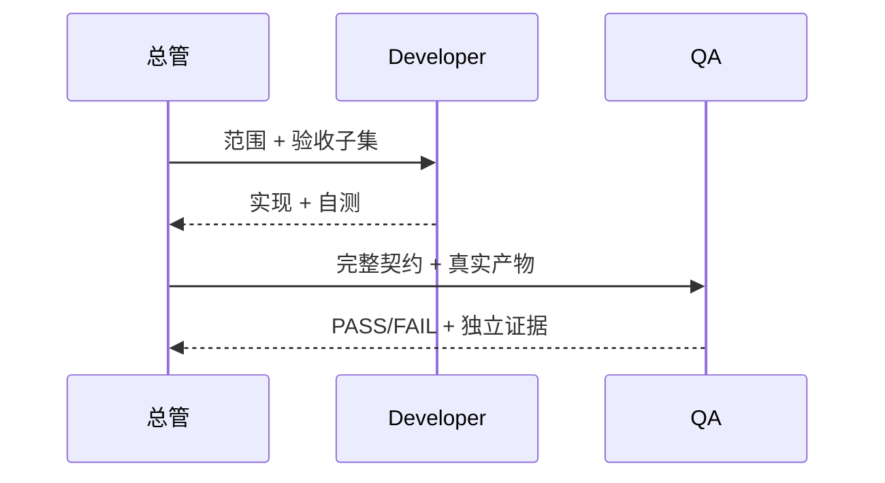

# 测试与验收

## 1. 质量模型

OPC 的测试不能只证明脚本能运行，还要证明组织承诺成立：没有 Mem0 时完整工作；Hook 不越界；开发与 QA 独立；安装可逆；知识来源可追溯。

## 2. 测试层级

| 层级 | 重点 |
|---|---|
| 静态验证 | Plugin/Marketplace Schema、Skill 结构、链接、编码、隐私模式 |
| 单元测试 | Marker 校验、状态机、Hash 验证、作用域过滤、降级逻辑 |
| 集成测试 | File/Git Repo、Mem0 Adapter、安装器、配置 Diff、Hook 事件 |
| 端到端 | 从经理意图到独立 QA 和复盘候选 |
| 迁移测试 | 旧配置和知识 Schema 的预览、迁移、回滚 |
| 发布测试 | 从固定 Git 标签在近似干净环境安装和卸载 |

## 3. 平台矩阵

最低矩阵：

| 平台 | File/Git | Mem0 未安装 | Mem0 启用 | Hook 隔离 | 安装/卸载 |
|---|---:|---:|---:|---:|---:|
| Windows PowerShell | 必测 | 必测 | 必测 | 必测 | 必测 |
| Linux shell | 必测 | 必测 | 必测 | 必测 | 必测 |

路径、换行、编码和执行权限都必须覆盖。文档与用户可见模板使用 UTF-8。

CI 对平台矩阵的兑现方式如下：

| CI 切片 | 操作系统 | Python | 验证范围 |
|---|---|---|---|
| Core | Windows、Linux | 3.10、3.12 | 不安装 Mem0 时的仓库验证、隐私扫描和完整测试集 |
| Optional Mem0 | Windows、Linux | 3.12 | 安装固定版本依赖、验证公开 import、运行完整测试集并构造真实 Adapter |

Optional Mem0 切片必须在安装依赖前从 `RUNNER_TEMP` 初始化 `MEM0_DIR`（即 GitHub Actions 的 `runner.temp`），通过 `GITHUB_ENV` 传递给后续所有步骤，并在整个 Job 级别设置 `MEM0_TELEMETRY=False`，防止导入、测试或构造阶段向用户目录写入数据或发送遥测。该切片不执行依赖外部模型凭证的 `add/search` 在线调用；它承诺的是固定依赖在两个操作系统上的本地导入、Adapter 构造、存储隔离和契约兼容性，不代表外部服务可用性。

## 4. Memory 测试矩阵

| 场景 | 预期结果 |
|---|---|
| 从未安装 Mem0 | FileRecall 返回结果，完整工作流通过 |
| Mem0 已安装但被禁用 | 不加载后端、不访问索引，基线通过 |
| 配置存在但依赖缺失 | Doctor 精确报告，运行时安全降级 |
| Mem0 超时/抛错 | 本次熔断，不写空结果，不阻塞核心流程 |
| 索引 Hash 过期 | 丢弃候选，回到 File/Git，可提示重建 |
| Mem0 返回未知引用 | 拒绝注入上下文 |
| 权威条目被标记失效 | 不作为当前规则召回，索引可清理 |
| 同名冲突条目 | Context Packet 标识冲突，不静默选一个 |
| 卸载 Mem0 | File/Git 内容、历史和基线召回不变 |

分层 File recall 另需覆盖：global/多项目隔离、role/type、obsolete、未解决冲突、stale index、index delete/rebuild、无 Mem0、disabled/provider timeout/error/disagreement、预算截断、canonical citations、omission、trace 无正文、L0/L1 不作为事实、导航与注入之间 canonical 变化、symlink/junction/reparse/hardlink、parent replacement/rollback、超限文件、重复 ID、strict schema/runtime parity 与 non-claim 阈值。

## 5. 评测基线

当前 File/Git、无成长增强工作流使用[版本化评测基线](evaluation-baseline.md)。公开纯合成 fixture 会在临时独立 Git 仓库中实际驱动 `FileGitBackend.query(...)` 与 provenance 校验，输出机器 JSON 和由其确定性生成的 Markdown；Windows/Linux CI 必须逐字节复现这两个产物。

分层比较另执行 `python scripts/hierarchical_evaluation.py verify`。它在同一新 fixture 上运行当前 flat 与 hierarchical，实现 result/report 逐字节复现；实际 wall-clock latency 保存在单独 versioned artifact，verify 严格校验其有限数值和可实现聚合，但不伪装为跨机器可重现测量。

分层专项还必须覆盖：derived relation 删除/替换/伪造不释放受治理正文；metadata snapshot 封锁完整 record parser、不得将 content sentinel 传给 `json.loads`，且只有最终 L2 调用 `read_authoritative(...)`；flat/hierarchical 在 chain、branch、diamond、mixed、inverse 与 ID/file/edge 排列下结果一致；mkdir/open/write/fsync/replace 每个发布故障点恢复调用前 tree；Packet/Trace 单体与联合 schema/runtime 损坏拒绝；evaluation case/aggregate/hash/threshold/status/claim 损坏在 renderer 前拒绝。

真实项目试点固定为 3–5 tasks。原始源码、对话、路径、运行标识、组织知识和逐任务结果留在私有项目证据边界，不进入公开仓库或 canonical knowledge；跨边界只允许严格 schema 的整体聚合。scope leakage 与 stale/obsolete acceptance 为零容忍，缺字段、零分母或不可验证结果不得记为 PASS。质量、context tokens 和 latency 必须并列报告，任何单项都不足以证明产品改进。

结构化反馈测试必须覆盖：PASS、FAIL、partial 和 unknown 合成结果；经理判断/独立 QA/假设/未知信息分离；旧 run 无 sidecar 可读；同事件幂等、同 ID 冲突、stale 与并发写入 fail closed；Draft 2020-12 schema 与运行时对非法引用的一致拒绝；事件/sidecar 读取上限；共享凭证规则且错误/报告不泄漏；父目录在 pending 前后、replace 前和最终清理前变化时的回滚；竞争 lock/pending identity 保留；机器记录与确定性人类报告同源。测试还要证明写入只产生项目私有 feedback sidecar，不触发候选批准、Git、索引、发布、付款或外部通信。

知识链路专项必须覆盖：recalled-but-unused、injected、adopted、ignored、overridden、contradicted、omitted；多个 role/step、exact Packet/Trace Hash 与完整 citation provenance，同 ID 不同 commit/hash 不得拼接；stale、cross-project、obsolete、unresolved conflict 在报告时降级；missing/disabled/failed/stale/no-memory Provider 不阻塞 File/Git；晚到 QA、feedback、outcome、Shadow、evaluation 只允许 association 引用且保持 portable/existing/bounded，knowledge/provider 携 evidence 必须由 Schema/runtime 拒绝；同事件幂等、冲突 ID、base-record + revision CAS、同 revision 替换、首次创建竞态、并发和发布故障无 partial；plan 必须 exact 绑定 project/run ID 与 instance Hash，run/project 在锁内或发布前切换、sidecar/lock 路径错配均 fail closed；进程内 binding 必须覆盖 project root、`.opc` 与 lineage 目录 identity，同字节整目录替换、rename、symlink/junction/reparse 与 ancestor identity 变化均零发布失败，且 token/inode/handle/绝对路径不得进入 plan、record、report 或日志；success、preview failure、lock failure、pending failure、subject mismatch 与 publish failure 后必须释放全部 handle/fd，并允许后续合法 rename/delete；还要在 project 已绑定但 `.opc` 尚未完成、preview subject/contract 校验以及 record internal preview/lock/pending/replace 后分别注入 `KeyboardInterrupt`/`SystemExit`，证明 BaseException 仍释放资源、回滚 sidecar 且无 partial；Git unavailable/timeout/异常 nonzero fail closed，明确 non-Git 可继续，exact-file-only ignore 拒绝，整个 `.opc/lineage/` 目录 ignore 且无 tracked 内容才允许 final/lock/pending/backup transaction artifacts；Windows 原始字节 Hash、8.3 identity、hardlink、symlink/reparse 和父目录变化 fail closed；Schema/runtime/renderer 聚合重算一致；旧 run 显示 lineage unavailable；preview 保持零写入；报告逐字包含 `association/evidence only`、confounders 和 unknowns。测试不得把 recalled/injected 推断为 adopted，也不得产生 canonical、Provider、Git、项目源码或 remote telemetry 写入。

## 6. Hook 隐私测试

至少包含以下自动化用例：

1. 非 OPC 目录触发所有已注册事件，断言零文件、零追加；
2. `.opc` 目录存在但 Marker 缺失/损坏，断言零记录；
3. Marker 的 `project_id` 不匹配、`active=false` 或已过期，断言零记录；
4. 有效运行只写字段白名单，不含完整环境、绝对敏感路径和原始 session/turn ID；
5. Workspace 外路径、目录穿越和符号链接逃逸被拒绝；
6. 日志轮换和并发写入不会破坏记录；
7. Hook 异常不影响普通 Codex 工作流。

任何非 OPC 事件被记录都属于 P0 阻断问题。

## 7. 安装、升级和卸载测试

| 用例 | 验收标准 |
|---|---|
| 首次安装 | 不要求作者本机路径，插件在新任务可发现 |
| 重复安装 | 结果幂等或给出安全、明确提示 |
| 知识目录非空 | 不覆盖，先检查和预览 |
| 可选配置 | 未确认时零修改；确认后有备份和准确 Diff |
| 升级 | Plugin 可替换，知识 Schema 安全迁移，索引可重建 |
| 卸载插件 | 私人知识和历史保留 |
| 重复卸载 | 不删除未知文件，不报破坏性错误 |
| 回滚 | 配置、Marketplace 和旧插件恢复后最小流程通过 |

仓库使用 `scripts/plugin_lifecycle_acceptance.py` 执行真实 Codex CLI 安装态 Gate，并通过 `codex debug prompt-input` 的全新进程输出精确验证 model-visible canonical Skill names。Pull Request 和 `main` push 在 disposable Windows/Linux Runner 中执行本地合成候选/回滚生命周期；固定标签发布另由手动工作流解析并钉住两个不可变 commit OID。隔离边界、脱敏报告和人工新任务抽查步骤见[安装态生命周期验收](installed-lifecycle-acceptance.md)。目录或假 CLI Fixture 只能测试编排契约，不能冒充实际插件发现证据。

## 8. 独立 QA 测试

正向端到端场景必须由不同职责完成：

测试应人为植入一个实现者未发现但验收契约可捕获的问题，证明 QA 会给出 FAIL，而不是复述开发报告。修复后重新验证，旧 FAIL 证据仍可追溯。

## 9. Release Gates

| Gate | 通过条件 |
|---|---|
| G1 设计 | 文档、Schema、ADR 和实际实现一致 |
| G2 隐私 | Secret/路径/标识/Git 历史扫描干净；Hook P0 用例通过 |
| G3 核心 | Windows/Linux 在无 Mem0 模式完成全流程 |
| G4 可选后端 | Windows/Linux 的 Python 3.12 固定依赖导入与真实 Adapter 构造通过；禁用、故障、过期和卸载场景通过 |
| G5 分发 | 从固定 Git 标签在隔离环境成功安装、发现和卸载 |
| G6 端到端 | 经理—总管—开发—独立 QA—交接完整且证据可复现 |
| G7 回滚 | 实际演练恢复上一版本/本地原型，知识无损 |
| G8 发布 | 版本、Changelog、Release Notes、安装与迁移说明一致 |

G1–G7 未全部通过不得创建稳定 Release；G8 在发布动作中完成。

G5/G7 的发布证据必须使用两个不同的固定 Ref；本地路径对同一版本执行的重装只证明包生命周期与幂等性，不证明版本回滚。候选标签尚未存在时，应把固定标签回滚 Gate 标记为待发布执行，不能用当前工作区结果替代。

## 10. 验收证据格式

每次 Gate 结果建议记录：测试版本/Commit、环境、时间、执行命令或操作、期望、实际结果、产物路径/链接、失败详情、验证者。包含私人路径或标识的原始证据不能直接上传公开 CI Artifact，应先脱敏或只保留摘要。

## 11. 失败处理

FAIL 是有效结果，不得通过降低验收标准或删除用例转成 PASS。若需求本身需要改变，先由经理批准更新 Acceptance Contract，再重新执行；QA 不能自行改变产品范围。BLOCKED 应说明外部依赖、已尝试动作和解除条件。
