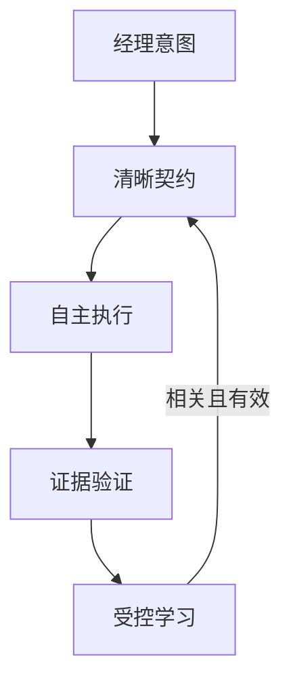

# 愿景与范围

## 1. 愿景

让一个人能在 Codex 中拥有一支长期协作的 AI 团队：用户管理方向，团队负责把想法变成经过独立验证的结果，并把可复用经验安全地带到下一个项目。

## 2. 目标用户

主要用户是依赖 Codex 完成真实项目的个人开发者、产品创作者和一人公司经营者。他们通常同时承担经理、产品、工程和运营职责，希望减少重复说明和过程监督，但仍保留关键决策权和最终体验判断。

## 3. 核心承诺

| 承诺 | 可观察结果 |
|---|---|
| 想法先对齐 | 执行前形成项目简报、范围和可验证验收条件 |
| 内部完成委派 | 总管根据任务选择角色并提供最小充分上下文 |
| 先验收再打扰经理 | 独立 QA 对真实产物进行验证，PASS 后才发起体验交接 |
| 跨项目保持连续性 | 新项目能召回相关、获批且仍有效的经验 |
| 经验可成长也可撤销 | 知识有来源、状态、验证记录、版本和回滚路径 |
| 安装可分享 | 从公开 Git 仓库安装，不依赖作者本机目录和私人配置 |

## 4. 产品原则

1. **经理的注意力是稀缺资源。** 只有方向冲突、显著风险、不可逆外部操作或范围扩张需要升级。
2. **自主不等于无边界。** 团队在已同意的范围和验收契约内自主工作。
3. **结果优先于角色表演。** 角色是职责和独立性的工具，不追求模拟会议或增加对话数量。
4. **证据优先于自我评价。** 构建输出、测试结果、截图、HTTP 响应或可复现步骤比“已经完成”更可信。
5. **长期记忆必须可治理。** 能写入不代表应该写入，能召回不代表应该相信。

## 5. v0.1 范围

| 范围内 | 范围外 |
|---|---|
| Codex Plugin 与 Git Marketplace 分发 | 替代 Codex 的独立 Agent 平台 |
| 项目启动、目标对齐、角色委派、独立 QA、复盘 | 长期驻留的后台自治公司 |
| File/Git 权威记忆和可选 Mem0 OSS 召回 | Mem0 Cloud 或自托管 Server 的生产运维 |
| Windows 与 Linux 基础安装/验证 | 为所有 IDE 和模型运行时提供通用 SDK |
| 私人知识初始化、迁移和卸载保留 | 把用户知识托管到公共仓库 |
| 安全降级、Doctor 和隐私门禁 | 无人工边界的自动发布、付费或外部沟通 |

## 6. 角色模型

角色不是固定人数，而是一组明确职责：

| 角色 | 主要职责 | 不能替代谁 |
|---|---|---|
| 经理（用户） | 决定目标、优先级、重大取舍和最终体验 | 不承担日常实现监督 |
| OPC 总管 | 对齐意图、建立契约、委派、汇总证据、升级风险 | 不能自行改变经理目标 |
| 产品/研究 | 澄清需求、事实调查、方案和边界 | 不能把建议当作已批准方向 |
| 开发/执行 | 在契约内实现并提供自测证据 | 不能验收自己的工作 |
| 独立 QA | 按契约验证真实产物并给出 PASS/FAIL | 不能为了通过而降低标准 |
| 记忆策展 | 审查经验候选、冲突、来源和有效性 | 不能未经批准修改组织规则 |

总管可以根据任务省略不必要角色，但“实现者”和“最终 QA”在有实质变更时必须独立。

## 7. 标准用户旅程

| 阶段 | 系统行为 | 经理参与 |
|---|---|---|
| 提案 | 理解目标、检查项目和既有知识 | 提供想法 |
| 对齐 | 输出简报、假设、范围、验收条件 | 确认重大方向 |
| 计划 | 划分任务、角色和依赖 | 通常无需参与 |
| 执行 | 角色 Agent 实现、测试、互相交接 | 仅处理升级项 |
| QA | 独立验证契约和真实运行状态 | 通常无需参与 |
| 体验 | 提供结果、证据、已知限制和体验路径 | 判断产品感受 |
| 复盘 | 形成经验候选并审核 | 只批准有组织影响的规则 |

## 8. 成功指标

首版不以 Agent 数量或自动对话轮数衡量成功，而关注：

- 从想法到明确验收契约的时间；
- QA 前需要经理介入的非关键次数；
- QA 首次通过率与失败发现质量；
- 经验召回的相关率、过期率和冲突率；
- 没有 Mem0 时的功能完整度；
- 安装、升级、卸载的可重复性；
- 非 OPC 项目零越界日志事件；
- 公开仓库零私人数据和凭据泄露。

## 9. “完成”的定义

一个 OPC 工作项只有同时满足以下条件才算完成：范围内实现已落地；验收契约中的检查有真实证据；独立 QA 给出 PASS；已知限制明确；经理获得可直接体验的入口。复盘和知识候选是闭环的一部分，但不得为了“成长”阻塞已完成结果的交接。
